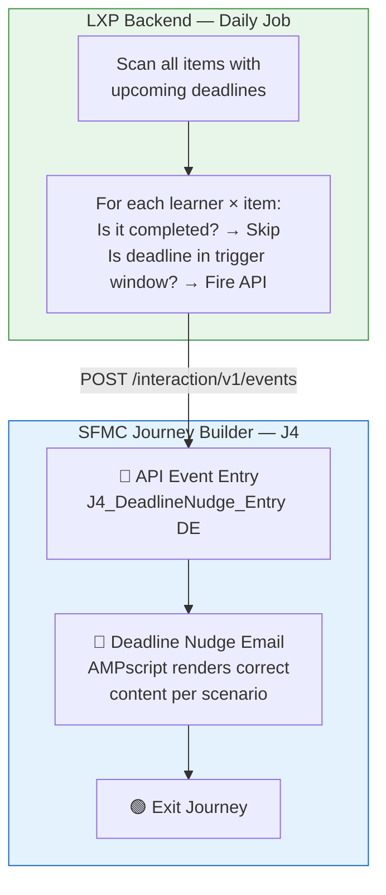
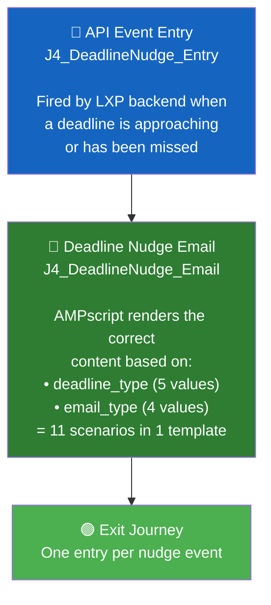

# LXP J4: Deadline Nudges — SFMC Implementation Document

> **Project**: ISB LXP Journeys  
> **Journey**: J4 — Deadline Nudges  
> **Architecture Pattern**: API Event Entry + Journey Builder (same as J3, J5, J6, J7)  
> **Date**: 26 August 2026  
> **Status**: Ready for Implementation

---

## 1. Overview

Learners work against four kinds of deadlines: assignments, modules, courses, and the overall programme. This journey sends the **last chance reminder** before each one, and one **follow-up after a miss**, so nothing slips by accident.

| Field | Specification |
|-------|--------------|
| **Objective** | Get learners to submit and complete their work before every deadline |
| **Who enters & when** | A learner enters only for items they have NOT completed yet, as that item's deadline gets close |
| **Trigger source** | Deadlines and per-learner completion status from the LXP backend (same triggers as in-app deadline notifications) |
| **Messages** | One short reminder email per deadline (timed by type) + one overdue email if missed |
| **When journey ends** | Immediately after each email — one entry per deadline event |
| **Edge case** | If a deadline is extended, reminders restart against the new date |
| **Data freshness** | Refreshed daily. Status re-checked just before every send so nobody who finished gets nudged |
| **Success metric** | Share of items completed on or before their deadline |

---

## 2. Email Matrix — All Scenarios

J4 has **4 deadline types**, each with specific timing and an overdue follow-up:

### Reminder Emails (Before Deadline)

| # | Deadline Type | When It Fires | Email Content | CTA |
|---|:---:|---|---|---|
| 1 | **Assignment** | **24 hours** before due date | Assignment name | **Submit** |
| 2 | **Module** | **1 day** before module deadline | Module name + bonus points at stake | **Open Module** |
| 3 | **Course (Soft)** | **1 day** before soft deadline | Complete for bonus points | **Complete for Bonus** |
| 4 | **Course (Hard)** | **1 day** before hard deadline | Last date to finish | **Finish Course** |
| 5 | **Programme** | **7 days** before programme deadline | One week left | **View Programme** |
| 6 | **Programme** | **1 day** before programme deadline | Final day tomorrow | **Complete Programme** |

### Overdue Emails (After Missed Deadline)

| # | Deadline Type | When It Fires | Email Content | CTA |
|---|:---:|---|---|---|
| 7 | **Assignment** | **1 day after** missed deadline | You can still submit | **Submit Now** |
| 8 | **Module** | **1 day after** missed deadline | What was missed + next steps | **Complete Module** |
| 9 | **Course (Soft)** | **1 day after** missed soft deadline | Bonus points lost + extended date confirmed | **Continue Course** |
| 10 | **Course (Hard)** | **1 day after** missed hard deadline | Points to support, programme office alerted | **Contact Support** |
| 11 | **Programme** | **1 day after** missed deadline | Points to support, programme office alerted | **Contact Support** |

### Rules (Applied to ALL Scenarios)

| Rule | Detail |
|------|--------|
| **Skip if completed** | Every send is skipped if the item is already completed or submitted |
| **Email = final call only** | Earlier warnings (3-day, 14-day) stay in-app only — email is the last chance |
| **Deep links** | Each email links to the exact page (assignment, module, course page) |
| **One overdue per item** | Maximum one overdue email per item, never more |
| **Deadline extended** | If deadline changes, reminders restart against the new date |

---

## 3. Architecture Overview

The LXP backend manages **all timing and completion checks**. It fires an API event at the right moment for each deadline scenario. The SFMC journey simply receives the event, sends the email, and exits.



> [!NOTE]
> **Why one journey, not four?** All 11 scenarios follow the exact same SFMC pattern: API Event → Email → Exit. The only difference is the email content, which AMPscript handles via conditionals on `deadline_type` and `email_type`. One journey is simpler to manage than four.

---

## 4. Installed Package

> **Reuse the existing Installed Package** — "API Entry Event LXP". Same credentials as J3/J5/J6/J7.

| Field | Value |
|-------|-------|
| Package Name | API Entry Event LXP *(existing)* |
| Account ID | `546009908` |
| Client ID | `p4rz87btz169z6ds4t2ajmmk` |
| Client Secret | `SFMC_m7RYKi_603hp4FDtqUXSpbkKLUG3cM8RVKO4wZEfpdiL3q8hfPV47cddbaf` |
| Auth Base URI | `https://mcdbsftt7qmg3r7qdz3gd5pfxd7m.auth.marketingcloudapis.com/` |
| REST Base URI | `https://mcdbsftt7qmg3r7qdz3gd5pfxd7m.rest.marketingcloudapis.com/` |

---

## 5. Data Extension

### `J4_DeadlineNudge_Entry` (API Event DE)

One Data Extension handles all deadline types. The `nudge_id` primary key prevents duplicate emails.

| API Payload Attribute | DE Field Name | Data Type | Length | Primary Key | Required | Notes |
|----------------------|---------------|-----------|--------|:-----------:|:--------:|-------|
| `ContactKey` | `ContactKey` | Text | 254 | — | ✅ | Contact Identifier (= userid) |
| `userid` | `userid` | Text | 254 | — | ✅ | SubscriberKey — must match ContactKey |
| `email` | `email` | EmailAddress | 254 | — | ✅ | Learner's email address |
| `name` | `name` | Text | 255 | — | ✅ | Learner's display name |
| `nudge_id` | `nudge_id` | Text | 500 | ✅ | ✅ | **Unique ID per nudge event — prevents duplicates** |
| `deadline_type` | `deadline_type` | Text | 50 | — | ✅ | `assignment`, `module`, `course_soft`, `course_hard`, `programme` |
| `email_type` | `email_type` | Text | 50 | — | ✅ | `reminder`, `reminder_7day`, `reminder_1day`, `overdue` |
| `item_name` | `item_name` | Text | 500 | — | ✅ | Name of the assignment/module/course/programme |
| `item_url` | `item_url` | Text | 1000 | — | ✅ | Deep link to the exact page |
| `deadline_date` | `deadline_date` | Text | 100 | — | ✅ | Formatted deadline date (e.g., "28 Aug 2026") |
| `programme_name` | `programme_name` | Text | 255 | — | — | Programme name |
| `bonus_points` | `bonus_points` | Text | 50 | — | — | Bonus points at stake (for module/course soft) |
| `extended_date` | `extended_date` | Text | 100 | — | — | Extended date (for course soft overdue) |
| `subject` | `subject` | Text | 500 | — | — | Custom subject line override |

> [!IMPORTANT]
> **`nudge_id` is the Primary Key** — not `userid`. A single learner has many deadlines. Each row = one nudge event. Format: `{userid}_{item_id}_{email_type}` e.g., `learner_001_ASSIGN-123_reminder`

### Deduplication via Primary Key

```
First reminder:    nudge_id = "learner_001_ASSIGN-123_reminder"  → ✅ Accepted → Email sent
Duplicate attempt: nudge_id = "learner_001_ASSIGN-123_reminder"  → ❌ Rejected (duplicate PK)
Overdue email:     nudge_id = "learner_001_ASSIGN-123_overdue"   → ✅ Accepted (different)
Different item:    nudge_id = "learner_001_ASSIGN-456_reminder"  → ✅ Accepted (different item)
```

This ensures: **one reminder per item + one overdue per item = maximum 2 emails per item per learner.**

---

## 6. Email Template (Content Builder)

One template handles all 11 scenarios using AMPscript conditionals on `deadline_type` and `email_type`.

### Template: `J4_DeadlineNudge_Email`

### AMPscript (top of email):

```
%%[

SET @name = AttributeValue("name")
SET @deadlineType = AttributeValue("deadline_type")
SET @emailType = AttributeValue("email_type")
SET @itemName = AttributeValue("item_name")
SET @itemURL = AttributeValue("item_url")
SET @deadlineDate = AttributeValue("deadline_date")
SET @programmeName = AttributeValue("programme_name")
SET @bonusPoints = AttributeValue("bonus_points")
SET @extendedDate = AttributeValue("extended_date")
SET @subject = AttributeValue("subject")

IF EMPTY(@name) THEN SET @name = "Learner" ENDIF

/* =============================================
   ASSIGNMENT
   ============================================= */
IF @deadlineType == "assignment" AND @emailType == "reminder" THEN
  SET @headline = CONCAT("Assignment due tomorrow: ", @itemName)
  SET @bodyText = CONCAT("Your assignment '", @itemName, "' is due on ", @deadlineDate, ". Don't forget to submit your work before the deadline.")
  SET @ctaText = "Submit Assignment"
  IF EMPTY(@subject) THEN
    SET @subject = CONCAT("⏰ ", @name, ", your assignment is due tomorrow")
  ENDIF

ELSEIF @deadlineType == "assignment" AND @emailType == "overdue" THEN
  SET @headline = CONCAT("Missed deadline: ", @itemName)
  SET @bodyText = CONCAT("The deadline for '", @itemName, "' has passed, but you can still submit. Don't leave it incomplete — submit now.")
  SET @ctaText = "Submit Now"
  IF EMPTY(@subject) THEN
    SET @subject = CONCAT("❗ ", @name, ", your assignment is overdue — you can still submit")
  ENDIF

/* =============================================
   MODULE
   ============================================= */
ELSEIF @deadlineType == "module" AND @emailType == "reminder" THEN
  SET @headline = CONCAT("Module deadline tomorrow: ", @itemName)
  SET @bodyText = CONCAT("The deadline for '", @itemName, "' is ", @deadlineDate, ".")
  IF NOT EMPTY(@bonusPoints) THEN
    SET @bodyText = CONCAT(@bodyText, " Complete it on time to earn your ", @bonusPoints, " bonus points.")
  ENDIF
  SET @ctaText = "Open Module"
  IF EMPTY(@subject) THEN
    SET @subject = CONCAT("⏰ ", @name, ", module deadline tomorrow — bonus points at stake")
  ENDIF

ELSEIF @deadlineType == "module" AND @emailType == "overdue" THEN
  SET @headline = CONCAT("Module overdue: ", @itemName)
  SET @bodyText = CONCAT("The deadline for '", @itemName, "' has passed. Complete it as soon as possible to stay on track.")
  SET @ctaText = "Complete Module"
  IF EMPTY(@subject) THEN
    SET @subject = CONCAT("❗ ", @name, ", module deadline missed for ", @itemName)
  ENDIF

/* =============================================
   COURSE — SOFT DEADLINE (bonus points)
   ============================================= */
ELSEIF @deadlineType == "course_soft" AND @emailType == "reminder" THEN
  SET @headline = CONCAT("Bonus deadline tomorrow: ", @itemName)
  SET @bodyText = CONCAT("Complete '", @itemName, "' by ", @deadlineDate, " to earn your ", @bonusPoints, " bonus points. After this date, you can still finish but without the bonus.")
  SET @ctaText = "Complete for Bonus Points"
  IF EMPTY(@subject) THEN
    SET @subject = CONCAT("⏰ ", @name, ", last day for bonus points in ", @itemName)
  ENDIF

ELSEIF @deadlineType == "course_soft" AND @emailType == "overdue" THEN
  SET @headline = CONCAT("Bonus deadline passed: ", @itemName)
  SET @bodyText = CONCAT("The bonus deadline for '", @itemName, "' has passed. The bonus points are no longer available.")
  IF NOT EMPTY(@extendedDate) THEN
    SET @bodyText = CONCAT(@bodyText, " You can still complete the course by the extended date: ", @extendedDate, ".")
  ENDIF
  SET @ctaText = "Continue Course"
  IF EMPTY(@subject) THEN
    SET @subject = CONCAT("ℹ️ ", @name, ", bonus deadline passed — you can still finish ", @itemName)
  ENDIF

/* =============================================
   COURSE — HARD DEADLINE (last date)
   ============================================= */
ELSEIF @deadlineType == "course_hard" AND @emailType == "reminder" THEN
  SET @headline = CONCAT("Final deadline tomorrow: ", @itemName)
  SET @bodyText = CONCAT("Tomorrow (", @deadlineDate, ") is the last date to finish '", @itemName, "'. After this, the course closes.")
  SET @ctaText = "Finish Course"
  IF EMPTY(@subject) THEN
    SET @subject = CONCAT("🚨 ", @name, ", final deadline tomorrow for ", @itemName)
  ENDIF

ELSEIF @deadlineType == "course_hard" AND @emailType == "overdue" THEN
  SET @headline = CONCAT("Course deadline missed: ", @itemName)
  SET @bodyText = CONCAT("The final deadline for '", @itemName, "' has passed. Please reach out to the programme office for support.")
  SET @ctaText = "Contact Support"
  IF EMPTY(@subject) THEN
    SET @subject = CONCAT("❗ ", @name, ", course deadline missed — support is available")
  ENDIF

/* =============================================
   PROGRAMME — 7 DAY REMINDER
   ============================================= */
ELSEIF @deadlineType == "programme" AND @emailType == "reminder_7day" THEN
  SET @headline = CONCAT("One week left: ", @programmeName)
  SET @bodyText = CONCAT("Your programme deadline is in 7 days (", @deadlineDate, "). Make sure all your coursework is complete and submitted.")
  SET @ctaText = "View Programme"
  IF EMPTY(@subject) THEN
    SET @subject = CONCAT("📅 ", @name, ", one week left to complete your programme")
  ENDIF

/* =============================================
   PROGRAMME — 1 DAY REMINDER
   ============================================= */
ELSEIF @deadlineType == "programme" AND @emailType == "reminder_1day" THEN
  SET @headline = CONCAT("Final day tomorrow: ", @programmeName)
  SET @bodyText = CONCAT("Tomorrow (", @deadlineDate, ") is your last day to complete the ", @programmeName, " programme. Ensure everything is submitted.")
  SET @ctaText = "Complete Programme"
  IF EMPTY(@subject) THEN
    SET @subject = CONCAT("🚨 ", @name, ", programme deadline is TOMORROW")
  ENDIF

/* =============================================
   PROGRAMME — OVERDUE
   ============================================= */
ELSEIF @deadlineType == "programme" AND @emailType == "overdue" THEN
  SET @headline = CONCAT("Programme deadline missed: ", @programmeName)
  SET @bodyText = CONCAT("The deadline for your ", @programmeName, " programme has passed. The programme office has been notified and will reach out to support you.")
  SET @ctaText = "Contact Support"
  IF EMPTY(@subject) THEN
    SET @subject = CONCAT("❗ ", @name, ", programme deadline missed — support is available")
  ENDIF

/* =============================================
   FALLBACK
   ============================================= */
ELSE
  SET @headline = CONCAT("Deadline reminder: ", @itemName)
  SET @bodyText = CONCAT("You have an upcoming deadline for '", @itemName, "'. Please complete it before ", @deadlineDate, ".")
  SET @ctaText = "Open Item"
  IF EMPTY(@subject) THEN
    SET @subject = CONCAT("⏰ Deadline reminder: ", @itemName)
  ENDIF

ENDIF

]%%
```

### Email Body (HTML):

```html
<h1>%%=v(@headline)=%%</h1>

<p>Hey %%=v(@name)=%%,</p>

<p>%%=v(@bodyText)=%%</p>

%%[ IF NOT EMPTY(@deadlineDate) AND @emailType != "overdue" THEN ]%%
<p><strong>Deadline:</strong> %%=v(@deadlineDate)=%%</p>
%%[ ENDIF ]%%

<div style="text-align:center; margin:32px 0;">
  <a href="%%=RedirectTo(@itemURL)=%%" 
     style="background-color:#0066CC; color:#fff; padding:14px 28px; 
            text-decoration:none; border-radius:4px; font-size:16px; font-weight:bold;">
     %%=v(@ctaText)=%% →
  </a>
</div>

<p style="color:#888; font-size:13px;">
  This is your final email reminder. Earlier notifications were sent in-app.
</p>
```

---

## 7. Journey Builder Setup

### 7.1 Create the API Event

1. Go to **Journey Builder → Entry Sources → Create New Event**
2. Select **API Event**
3. Link it to Data Extension: `J4_DeadlineNudge_Entry`
4. Save and note the generated **Event Definition Key**

### 7.2 Journey Settings

| Setting | Value |
|---------|-------|
| Journey Name | `J4 — Deadline Nudges` |
| Entry Source | API Event |
| Contact Entry | **Re-entry anytime** |
| Default Email Address | Use email attribute from Entry Source → `email` |

> [!IMPORTANT]
> **Re-entry must be "Re-entry anytime"** — a single learner can have many deadline nudges (multiple assignments, modules, courses, programme). Each nudge is a separate journey entry with a unique `nudge_id`.

### 7.3 Journey Canvas

Same simple pattern as J6 and J7 — API Event → Email → Exit:



**Two steps. No waits. No Decision Splits.**

The LXP backend checks completion status BEFORE firing the API event. By the time the event reaches SFMC, the decision to send has already been made.

### 7.4 Configuring Each Step

#### Step 1 — API Event Entry
- Linked to `J4_DeadlineNudge_Entry` DE
- All payload attributes auto-map

#### Step 2 — Email
- Template: `J4_DeadlineNudge_Email`
- From Name: `[Need to Confirm]`
- From Address: `[Need to Confirm]`
- Reply-To: `[Need to Confirm]`

---

## 8. LXP Backend Integration

### 8.1 Authentication (Same as All Journeys)

```
POST https://mcdbsftt7qmg3r7qdz3gd5pfxd7m.auth.marketingcloudapis.com/v2/token

{
  "grant_type": "client_credentials",
  "client_id": "p4rz87btz169z6ds4t2ajmmk",
  "client_secret": "SFMC_m7RYKi_603hp4FDtqUXSpbkKLUG3cM8RVKO4wZEfpdiL3q8hfPV47cddbaf",
  "account_id": "546009908"
}
```

### 8.2 Daily Job — Deadline Scanner

One daily job (e.g., 2:00 AM IST) handles ALL deadline types:

```
Daily Deadline Scanner Job:
│
├── 1. AUTHENTICATE with SFMC (cache token for 18 min)
│
├── 2. SCAN all items with deadlines across all types
│
├── 3. For each learner × item:
│   │
│   ├── Is item already completed/submitted?
│   │   └── YES → Skip (no email needed)
│   │
│   ├── What deadline window applies TODAY?
│   │   ├── Assignment deadline = tomorrow?      → Fire reminder
│   │   ├── Module deadline = tomorrow?          → Fire reminder
│   │   ├── Course soft deadline = tomorrow?     → Fire reminder
│   │   ├── Course hard deadline = tomorrow?     → Fire reminder
│   │   ├── Programme deadline = 7 days away?    → Fire reminder_7day
│   │   ├── Programme deadline = tomorrow?       → Fire reminder_1day
│   │   ├── ANY deadline = yesterday + not done? → Fire overdue
│   │   └── None of the above                   → Skip
│   │
│   └── FIRE API Event:
│       POST /interaction/v1/events
│       nudge_id = {userid}_{item_id}_{email_type}
│       → SFMC DE primary key handles dedup automatically
│
└── Done
```

### 8.3 Fire Event — API Payload

**Endpoint:**
```
POST {REST Base URI}/interaction/v1/events
Authorization: Bearer {access_token}
Content-Type: application/json
```

---

**Assignment Reminder (24h before):**
```json
{
  "ContactKey": "learner_001",
  "EventDefinitionKey": "APIEvent-{your-J4-event-definition-key}",
  "Data": {
    "userid": "learner_001",
    "email": "rahul@gmail.com",
    "name": "Rahul Sharma",
    "nudge_id": "learner_001_ASSIGN-123_reminder",
    "deadline_type": "assignment",
    "email_type": "reminder",
    "item_name": "Case Study: Digital Strategy",
    "item_url": "https://lxp.isb.edu/mod/assign/view.php?id=123",
    "deadline_date": "27 Aug 2026",
    "programme_name": "ISB Executive Programme",
    "bonus_points": "",
    "extended_date": "",
    "subject": ""
  }
}
```

**Module Reminder (1 day before — bonus points at stake):**
```json
{
  "ContactKey": "learner_002",
  "EventDefinitionKey": "APIEvent-{your-J4-event-definition-key}",
  "Data": {
    "userid": "learner_002",
    "email": "priya@gmail.com",
    "name": "Priya Patel",
    "nudge_id": "learner_002_MOD-456_reminder",
    "deadline_type": "module",
    "email_type": "reminder",
    "item_name": "Leadership Essentials",
    "item_url": "https://lxp.isb.edu/mod/page/view.php?id=456",
    "deadline_date": "28 Aug 2026",
    "programme_name": "ISB Executive Programme",
    "bonus_points": "50",
    "extended_date": "",
    "subject": ""
  }
}
```

**Course Soft Deadline Overdue (1 day after missed — bonus lost + extended date):**
```json
{
  "ContactKey": "learner_003",
  "EventDefinitionKey": "APIEvent-{your-J4-event-definition-key}",
  "Data": {
    "userid": "learner_003",
    "email": "amit@gmail.com",
    "name": "Amit Kumar",
    "nudge_id": "learner_003_COURSE-789_overdue_soft",
    "deadline_type": "course_soft",
    "email_type": "overdue",
    "item_name": "Digital Transformation Strategy",
    "item_url": "https://lxp.isb.edu/course/view.php?id=789",
    "deadline_date": "25 Aug 2026",
    "programme_name": "ISB Executive Programme",
    "bonus_points": "100",
    "extended_date": "15 Sep 2026",
    "subject": ""
  }
}
```

**Programme Reminder (7 days before):**
```json
{
  "ContactKey": "learner_001",
  "EventDefinitionKey": "APIEvent-{your-J4-event-definition-key}",
  "Data": {
    "userid": "learner_001",
    "email": "rahul@gmail.com",
    "name": "Rahul Sharma",
    "nudge_id": "learner_001_PROG-001_reminder_7day",
    "deadline_type": "programme",
    "email_type": "reminder_7day",
    "item_name": "ISB Executive Programme",
    "item_url": "https://lxp.isb.edu/programme/dashboard.php",
    "deadline_date": "02 Sep 2026",
    "programme_name": "ISB Executive Programme",
    "bonus_points": "",
    "extended_date": "",
    "subject": ""
  }
}
```

**Programme Overdue (1 day after — programme office alerted):**
```json
{
  "ContactKey": "learner_001",
  "EventDefinitionKey": "APIEvent-{your-J4-event-definition-key}",
  "Data": {
    "userid": "learner_001",
    "email": "rahul@gmail.com",
    "name": "Rahul Sharma",
    "nudge_id": "learner_001_PROG-001_overdue",
    "deadline_type": "programme",
    "email_type": "overdue",
    "item_name": "ISB Executive Programme",
    "item_url": "https://lxp.isb.edu/programme/dashboard.php",
    "deadline_date": "02 Sep 2026",
    "programme_name": "ISB Executive Programme",
    "bonus_points": "",
    "extended_date": "",
    "subject": ""
  }
}
```

### 8.4 `deadline_type` and `email_type` Values

**deadline_type (5 values):**

| Value | Deadline Type |
|-------|--------------|
| `assignment` | Assignment submission deadline |
| `module` | Module completion deadline |
| `course_soft` | Course soft deadline (bonus points) |
| `course_hard` | Course hard deadline (last date to finish) |
| `programme` | Overall programme deadline |

**email_type (4 values):**

| Value | When Used |
|-------|-----------|
| `reminder` | Assignment (24h before), Module (1d before), Course soft (1d before), Course hard (1d before) |
| `reminder_7day` | Programme only (7 days before) |
| `reminder_1day` | Programme only (1 day before) |
| `overdue` | All types (1 day after missed deadline) |

### 8.5 `nudge_id` Format

| Scenario | nudge_id Example |
|----------|-----------------|
| Assignment reminder | `learner_001_ASSIGN-123_reminder` |
| Assignment overdue | `learner_001_ASSIGN-123_overdue` |
| Module reminder | `learner_001_MOD-456_reminder` |
| Module overdue | `learner_001_MOD-456_overdue` |
| Course soft reminder | `learner_001_COURSE-789_reminder_soft` |
| Course hard reminder | `learner_001_COURSE-789_reminder_hard` |
| Course soft overdue | `learner_001_COURSE-789_overdue_soft` |
| Course hard overdue | `learner_001_COURSE-789_overdue_hard` |
| Programme 7-day | `learner_001_PROG-001_reminder_7day` |
| Programme 1-day | `learner_001_PROG-001_reminder_1day` |
| Programme overdue | `learner_001_PROG-001_overdue` |

---

## 9. Deadline Extension Handling

When a deadline is extended on the LXP platform:

```
Example: Assignment ASSIGN-123 deadline extended from Aug 27 to Sep 5

1. Old nudge_id "learner_001_ASSIGN-123_reminder" was already sent on Aug 26
   → That row exists in the DE → won't be re-sent ✅

2. LXP backend generates a NEW nudge_id for the new deadline:
   → "learner_001_ASSIGN-123_reminder_ext1"
   → This fires 24h before the NEW deadline (Sep 4)
   → New nudge_id → passes DE primary key check ✅

3. Overdue check recalculates against the new deadline (Sep 5)
   → "learner_001_ASSIGN-123_overdue_ext1"
```

> [!NOTE]
> The LXP backend appends a version suffix (e.g., `_ext1`, `_ext2`) to the `nudge_id` when a deadline is extended. This allows the new reminder to pass the DE primary key check while keeping the original reminder logged.

---

## 10. Programme Office Alerts (for Hard/Programme Overdue)

The spec says: *"A missed hard or programme deadline points the learner to support while the programme office is alerted."*

For hard deadline and programme overdue emails, the **programme office also needs to be notified**.

**Recommended approach:** The LXP backend handles this directly — when it fires the overdue event for a hard/programme deadline, it also sends a separate notification to the programme office via its own email system or a separate SFMC API call.

> [!WARNING]
> **Same blocker as J5** — programme office alert routing needs confirmation. The learner-facing overdue email works without this. The programme office alert can be added later.

---

## 11. Testing via Postman

### Test All Scenarios

| # | Test | `deadline_type` | `email_type` | Expected Subject |
|---|------|----------------|-------------|-----------------|
| 1 | Assignment reminder | `assignment` | `reminder` | ⏰ ..., your assignment is due tomorrow |
| 2 | Assignment overdue | `assignment` | `overdue` | ❗ ..., your assignment is overdue |
| 3 | Module reminder | `module` | `reminder` | ⏰ ..., module deadline tomorrow — bonus points |
| 4 | Module overdue | `module` | `overdue` | ❗ ..., module deadline missed |
| 5 | Course soft reminder | `course_soft` | `reminder` | ⏰ ..., last day for bonus points |
| 6 | Course hard reminder | `course_hard` | `reminder` | 🚨 ..., final deadline tomorrow |
| 7 | Course soft overdue | `course_soft` | `overdue` | ℹ️ ..., bonus deadline passed |
| 8 | Course hard overdue | `course_hard` | `overdue` | ❗ ..., course deadline missed |
| 9 | Programme 7-day | `programme` | `reminder_7day` | 📅 ..., one week left |
| 10 | Programme 1-day | `programme` | `reminder_1day` | 🚨 ..., programme deadline is TOMORROW |
| 11 | Programme overdue | `programme` | `overdue` | ❗ ..., programme deadline missed |
| 12 | Duplicate nudge_id | same as #1 | same | SFMC rejects — duplicate PK |
| 13 | Multiple deadlines, same learner | different nudge_ids | different | All emails sent — re-entry works |

### Testing Checklist

| # | Test | Expected Result | ✓ |
|---|------|----------------|---|
| 1 | All 11 deadline scenarios | Correct headline, body, CTA per scenario | ☐ |
| 2 | Duplicate `nudge_id` | SFMC rejects — no duplicate email | ☐ |
| 3 | Multiple deadlines, same learner | All emails sent (re-entry anytime) | ☐ |
| 4 | Bonus points rendered | Shows in module and course_soft emails | ☐ |
| 5 | Extended date rendered | Shows in course_soft overdue email | ☐ |
| 6 | CTA links to correct page | Deep link opens correct page | ☐ |
| 7 | Fallback for unknown type | Generic reminder renders | ☐ |

---

## 12. Complete Setup Order

```
Phase 1: SFMC Data Layer
├── 1. Verify Installed Package scopes
└── 2. Create DE: J4_DeadlineNudge_Entry (PK = nudge_id)

Phase 2: SFMC Content
└── 3. Create Email: J4_DeadlineNudge_Email
        (AMPscript with conditionals for all 11 scenarios)

Phase 3: SFMC Journey
├── 4. Create API Event → link to J4_DeadlineNudge_Entry DE
├── 5. Build journey canvas: Entry → Email → Exit
├── 6. Configure re-entry: "Re-entry anytime"
├── 7. Configure Default Email Address (Entry Source → email)
├── 8. Configure From Address / Reply-To (once confirmed)
└── 9. Set journey to TEST mode

Phase 4: Testing
├── 10. Test all 11 scenarios via Postman
├── 11. Test deduplication (duplicate nudge_id rejected)
├── 12. Test multiple deadlines for same learner
└── 13. Verify all CTAs, deep links, and subject lines

Phase 5: LXP Backend
├── 14. Build daily deadline scanner job
├── 15. Implement completion check before each API call
├── 16. Implement nudge_id generation
├── 17. Implement deadline extension handling (versioned nudge_ids)
├── 18. Implement overdue detection (deadline = yesterday + not completed)
└── 19. Implement programme office alerting (for hard/programme overdue)

Phase 6: Go Live
├── 20. Activate journey
├── 21. Enable daily scanner
├── 22. Monitor first batch
└── 23. Set up reporting (per deadline type)
```

---

## 13. Open Questions — Need Confirmation

| # | Question | Impact | Status |
|---|----------|--------|--------|
| 1 | **From Address**: What email/display name for deadline nudges? | Email config | ⏳ Pending |
| 2 | **Email Design**: Approved creative for deadline emails? | Template | ⏳ Pending |
| 3 | **Bonus points values**: Where does LXP store bonus point values per module/course? | Personalization | ⏳ Pending |
| 4 | **Deep link formats**: Exact URL patterns for each page type? | CTA links | ⏳ Pending |
| 5 | **Programme office alert**: Who receives alerts for hard/programme overdue? | Overdue handling | ⏳ Pending |
| 6 | **Moodle completion sync**: How often does completion status sync? | Check accuracy | ⏳ Pending |
| 7 | **Deadline extension trigger**: How is the backend notified of changes? | Edge case | ⏳ Pending |
| 8 | **Scanner job timing**: What time should the daily job run? | Scheduling | ⏳ Pending |

---

## 14. All Journeys Summary

| | J3 ✅ | J4 🔨 | J5 🔨 | J6 🔨 | J7 🔨 |
|---|---|---|---|---|---|
| **Name** | Session Reminders | **Deadline Nudges** | Inactivity | Certificate | Content Unlock |
| **Approach** | Journey Builder | **Journey Builder** | Journey Builder | Journey Builder | Journey Builder |
| **Entry** | API Event | **API Event** | API Event | API Event | API Event |
| **Canvas** | Linear (2 waits) | **Single step** | Branching (Splits) | Single step | Single step |
| **Data Extensions** | 1 | **1** | 2 | 1 | 1 |
| **Contact Builder** | No | **No** | Yes | No | No |
| **Email Templates** | 2 | **1** (11 scenarios) | 2 | 1 (4 cert types) | 1 (Start/Continue) |
| **LXP Backend** | 1 event | **1 daily job** | 2 daily jobs | 1 real-time event | 1 real-time event |
| **Re-entry** | Per-session | **Anytime** | 14-day cooldown | Anytime | Anytime |
| **Complexity** | Medium | **Medium** | High | Low | Low |
| **Blockers** | None | **Prog. office alert** | Day 21 + re-entry | Release fix | None |
