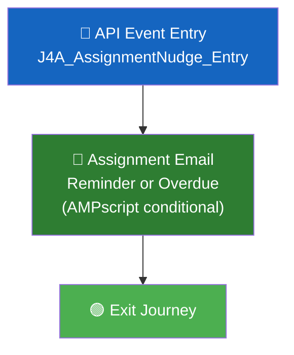
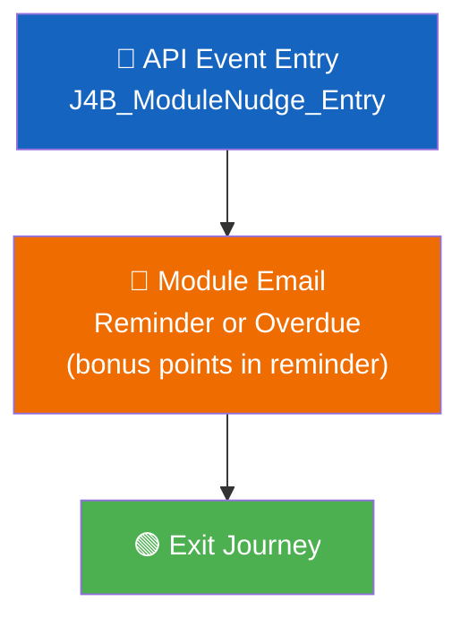
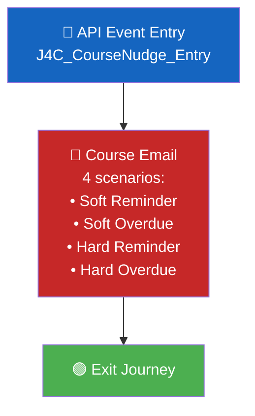
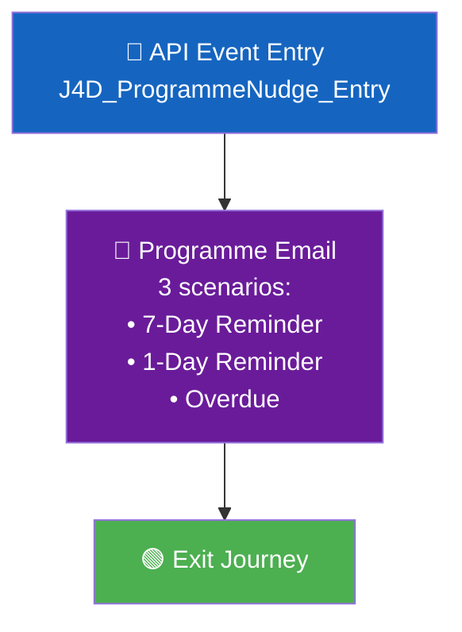

# LXP J4: Deadline Nudges — Multi-Journey Blueprint

> **Project**: ISB LXP Journeys  
> **Journey**: J4 — Deadline Nudges (Split into 4 Sub-Journeys)  
> **Architecture Pattern**: API Event Entry + Journey Builder  
> **Date**: 27 August 2026

---

## 1. Overview

Same requirement as before — but instead of cramming all 11 scenarios into one journey with complex AMPscript, we split into **4 dedicated journeys**, one per deadline type:

| Journey | Deadline Type | Emails | Scenarios |
|---------|:---:|:---:|---|
| **J4A** | Assignment | 2 | 1 reminder (24h before) + 1 overdue |
| **J4B** | Module | 2 | 1 reminder (1d before) + 1 overdue |
| **J4C** | Course | 4 | Soft reminder + Hard reminder + Soft overdue + Hard overdue |
| **J4D** | Programme | 3 | 7-day reminder + 1-day reminder + 1 overdue |

---

## 2. Why Split vs Single Journey

| | Single Journey (Previous Blueprint) | Multi-Journey (This Blueprint) |
|---|---|---|
| **Journeys to manage** | 1 | 4 |
| **Data Extensions** | 1 (shared) | 4 (one each) |
| **API Events** | 1 | 4 |
| **Email templates** | 1 (complex AMPscript — 11 conditionals) | 4 (simple AMPscript — 2-4 conditionals each) |
| **Testing** | Test all 11 scenarios in one journey | Test each journey independently |
| **Activate/Pause** | All-or-nothing | **Can pause Assignment nudges without affecting Module nudges** |
| **Different From Address** | Same for all | **Can set different sender per type** |
| **Reporting** | Combined (must filter by DE field) | **Separate analytics per journey** ⭐ |
| **Template maintenance** | One change could break all 11 | Each template is isolated |
| **LXP backend** | 1 Event Definition Key | 4 Event Definition Keys |

---

## 3. Installed Package

> **Reuse the existing Installed Package** — same credentials for all 4 journeys.

| Field | Value |
|-------|-------|
| Package Name | API Entry Event LXP *(existing)* |
| Account ID | `546009908` |
| Client ID | `p4rz87btz169z6ds4t2ajmmk` |
| Client Secret | `SFMC_m7RYKi_603hp4FDtqUXSpbkKLUG3cM8RVKO4wZEfpdiL3q8hfPV47cddbaf` |
| Auth Base URI | `https://mcdbsftt7qmg3r7qdz3gd5pfxd7m.auth.marketingcloudapis.com/` |
| REST Base URI | `https://mcdbsftt7qmg3r7qdz3gd5pfxd7m.rest.marketingcloudapis.com/` |

---

---

# J4A: Assignment Deadline Nudge

---

## J4A.1 — Specification

| Field | Value |
|-------|-------|
| **What it does** | Reminds learners 24 hours before an assignment due date, and follows up 1 day after if missed |
| **Emails** | 2: Reminder + Overdue |
| **CTA** | Reminder: "Submit Assignment" / Overdue: "Submit Now" |

---

## J4A.2 — Data Extension: `J4A_AssignmentNudge_Entry`

| DE Field Name | Data Type | Length | PK | Required | Notes |
|---------------|-----------|--------|:--:|:--------:|-------|
| `ContactKey` | Text | 254 | — | ✅ | = userid |
| `userid` | Text | 254 | — | ✅ | SubscriberKey |
| `email` | EmailAddress | 254 | — | ✅ | Learner's email |
| `name` | Text | 255 | — | ✅ | Learner's name |
| `nudge_id` | Text | 500 | ✅ | ✅ | e.g., `learner_001_ASSIGN-123_reminder` |
| `email_type` | Text | 50 | — | ✅ | `reminder` or `overdue` |
| `assignment_name` | Text | 500 | — | ✅ | Name of the assignment |
| `assignment_url` | Text | 1000 | — | ✅ | Deep link to assignment submission page |
| `deadline_date` | Text | 100 | — | ✅ | Formatted deadline date |
| `programme_name` | Text | 255 | — | — | Programme name |

---

## J4A.3 — Email Template: `J4A_AssignmentNudge_Email`

```
%%[

SET @name = AttributeValue("name")
SET @emailType = AttributeValue("email_type")
SET @assignmentName = AttributeValue("assignment_name")
SET @assignmentURL = AttributeValue("assignment_url")
SET @deadlineDate = AttributeValue("deadline_date")

IF EMPTY(@name) THEN SET @name = "Learner" ENDIF

IF @emailType == "reminder" THEN
  SET @headline = CONCAT("Assignment due tomorrow: ", @assignmentName)
  SET @bodyText = CONCAT("Your assignment '", @assignmentName, "' is due on ", @deadlineDate, ". Don't forget to submit your work before the deadline.")
  SET @ctaText = "Submit Assignment"
  SET @subject = CONCAT("⏰ ", @name, ", your assignment is due tomorrow")

ELSEIF @emailType == "overdue" THEN
  SET @headline = CONCAT("Missed deadline: ", @assignmentName)
  SET @bodyText = CONCAT("The deadline for '", @assignmentName, "' has passed, but you can still submit. Don't leave it incomplete — submit now.")
  SET @ctaText = "Submit Now"
  SET @subject = CONCAT("❗ ", @name, ", your assignment is overdue — you can still submit")

ENDIF

]%%
```

```html
<h1>%%=v(@headline)=%%</h1>
<p>Hey %%=v(@name)=%%,</p>
<p>%%=v(@bodyText)=%%</p>

%%[ IF @emailType == "reminder" THEN ]%%
<p><strong>Deadline:</strong> %%=v(@deadlineDate)=%%</p>
%%[ ENDIF ]%%

<div style="text-align:center; margin:32px 0;">
  <a href="%%=RedirectTo(@assignmentURL)=%%" 
     style="background-color:#0066CC; color:#fff; padding:14px 28px; 
            text-decoration:none; border-radius:4px; font-size:16px; font-weight:bold;">
     %%=v(@ctaText)=%% →
  </a>
</div>
```

---

## J4A.4 — Journey Canvas



| Setting | Value |
|---------|-------|
| Journey Name | `J4A — Assignment Deadline Nudge` |
| Entry Source | API Event → `J4A_AssignmentNudge_Entry` |
| Contact Entry | **Re-entry anytime** |
| Default Email | Entry Source → `email` |

---

## J4A.5 — API Payloads

**Reminder (24h before):**
```json
{
  "ContactKey": "learner_001",
  "EventDefinitionKey": "APIEvent-{J4A-event-key}",
  "Data": {
    "userid": "learner_001",
    "email": "rahul@gmail.com",
    "name": "Rahul Sharma",
    "nudge_id": "learner_001_ASSIGN-123_reminder",
    "email_type": "reminder",
    "assignment_name": "Case Study: Digital Strategy",
    "assignment_url": "https://lxp.isb.edu/mod/assign/view.php?id=123",
    "deadline_date": "27 Aug 2026",
    "programme_name": "ISB Executive Programme"
  }
}
```

**Overdue (1 day after):**
```json
{
  "ContactKey": "learner_001",
  "EventDefinitionKey": "APIEvent-{J4A-event-key}",
  "Data": {
    "userid": "learner_001",
    "email": "rahul@gmail.com",
    "name": "Rahul Sharma",
    "nudge_id": "learner_001_ASSIGN-123_overdue",
    "email_type": "overdue",
    "assignment_name": "Case Study: Digital Strategy",
    "assignment_url": "https://lxp.isb.edu/mod/assign/view.php?id=123",
    "deadline_date": "27 Aug 2026",
    "programme_name": "ISB Executive Programme"
  }
}
```

---

---

# J4B: Module Deadline Nudge

---

## J4B.1 — Specification

| Field | Value |
|-------|-------|
| **What it does** | Reminds learners 1 day before a module deadline (highlighting bonus points at stake), and follows up 1 day after if missed |
| **Emails** | 2: Reminder + Overdue |
| **CTA** | Reminder: "Open Module" / Overdue: "Complete Module" |

---

## J4B.2 — Data Extension: `J4B_ModuleNudge_Entry`

| DE Field Name | Data Type | Length | PK | Required | Notes |
|---------------|-----------|--------|:--:|:--------:|-------|
| `ContactKey` | Text | 254 | — | ✅ | = userid |
| `userid` | Text | 254 | — | ✅ | SubscriberKey |
| `email` | EmailAddress | 254 | — | ✅ | Learner's email |
| `name` | Text | 255 | — | ✅ | Learner's name |
| `nudge_id` | Text | 500 | ✅ | ✅ | e.g., `learner_001_MOD-456_reminder` |
| `email_type` | Text | 50 | — | ✅ | `reminder` or `overdue` |
| `module_name` | Text | 500 | — | ✅ | Name of the module |
| `module_url` | Text | 1000 | — | ✅ | Deep link to module page |
| `deadline_date` | Text | 100 | — | ✅ | Formatted deadline date |
| `bonus_points` | Text | 50 | — | — | Bonus points at stake |
| `programme_name` | Text | 255 | — | — | Programme name |

---

## J4B.3 — Email Template: `J4B_ModuleNudge_Email`

```
%%[

SET @name = AttributeValue("name")
SET @emailType = AttributeValue("email_type")
SET @moduleName = AttributeValue("module_name")
SET @moduleURL = AttributeValue("module_url")
SET @deadlineDate = AttributeValue("deadline_date")
SET @bonusPoints = AttributeValue("bonus_points")

IF EMPTY(@name) THEN SET @name = "Learner" ENDIF

IF @emailType == "reminder" THEN
  SET @headline = CONCAT("Module deadline tomorrow: ", @moduleName)
  SET @bodyText = CONCAT("The deadline for '", @moduleName, "' is ", @deadlineDate, ".")
  IF NOT EMPTY(@bonusPoints) THEN
    SET @bodyText = CONCAT(@bodyText, " Complete it on time to earn your ", @bonusPoints, " bonus points.")
  ENDIF
  SET @ctaText = "Open Module"
  SET @subject = CONCAT("⏰ ", @name, ", module deadline tomorrow — bonus points at stake")

ELSEIF @emailType == "overdue" THEN
  SET @headline = CONCAT("Module overdue: ", @moduleName)
  SET @bodyText = CONCAT("The deadline for '", @moduleName, "' has passed. Complete it as soon as possible to stay on track.")
  SET @ctaText = "Complete Module"
  SET @subject = CONCAT("❗ ", @name, ", module deadline missed for ", @moduleName)

ENDIF

]%%
```

```html
<h1>%%=v(@headline)=%%</h1>
<p>Hey %%=v(@name)=%%,</p>
<p>%%=v(@bodyText)=%%</p>

%%[ IF @emailType == "reminder" THEN ]%%
<p><strong>Deadline:</strong> %%=v(@deadlineDate)=%%</p>
%%[ ENDIF ]%%

<div style="text-align:center; margin:32px 0;">
  <a href="%%=RedirectTo(@moduleURL)=%%" 
     style="background-color:#0066CC; color:#fff; padding:14px 28px; 
            text-decoration:none; border-radius:4px; font-size:16px; font-weight:bold;">
     %%=v(@ctaText)=%% →
  </a>
</div>
```

---

## J4B.4 — Journey Canvas



| Setting | Value |
|---------|-------|
| Journey Name | `J4B — Module Deadline Nudge` |
| Entry Source | API Event → `J4B_ModuleNudge_Entry` |
| Contact Entry | **Re-entry anytime** |
| Default Email | Entry Source → `email` |

---

## J4B.5 — API Payloads

**Reminder (1 day before):**
```json
{
  "ContactKey": "learner_002",
  "EventDefinitionKey": "APIEvent-{J4B-event-key}",
  "Data": {
    "userid": "learner_002",
    "email": "priya@gmail.com",
    "name": "Priya Patel",
    "nudge_id": "learner_002_MOD-456_reminder",
    "email_type": "reminder",
    "module_name": "Leadership Essentials",
    "module_url": "https://lxp.isb.edu/mod/page/view.php?id=456",
    "deadline_date": "28 Aug 2026",
    "bonus_points": "50",
    "programme_name": "ISB Executive Programme"
  }
}
```

**Overdue (1 day after):**
```json
{
  "ContactKey": "learner_002",
  "EventDefinitionKey": "APIEvent-{J4B-event-key}",
  "Data": {
    "userid": "learner_002",
    "email": "priya@gmail.com",
    "name": "Priya Patel",
    "nudge_id": "learner_002_MOD-456_overdue",
    "email_type": "overdue",
    "module_name": "Leadership Essentials",
    "module_url": "https://lxp.isb.edu/mod/page/view.php?id=456",
    "deadline_date": "28 Aug 2026",
    "bonus_points": "50",
    "programme_name": "ISB Executive Programme"
  }
}
```

---

---

# J4C: Course Deadline Nudge

---

## J4C.1 — Specification

| Field | Value |
|-------|-------|
| **What it does** | Handles both **soft** (bonus points) and **hard** (last date) course deadlines with reminders and overdue follow-ups |
| **Emails** | 4: Soft reminder + Hard reminder + Soft overdue + Hard overdue |
| **Key detail** | Soft overdue shows extended date + bonus lost. Hard overdue points to support + programme office alerted. |

---

## J4C.2 — Data Extension: `J4C_CourseNudge_Entry`

| DE Field Name | Data Type | Length | PK | Required | Notes |
|---------------|-----------|--------|:--:|:--------:|-------|
| `ContactKey` | Text | 254 | — | ✅ | = userid |
| `userid` | Text | 254 | — | ✅ | SubscriberKey |
| `email` | EmailAddress | 254 | — | ✅ | Learner's email |
| `name` | Text | 255 | — | ✅ | Learner's name |
| `nudge_id` | Text | 500 | ✅ | ✅ | e.g., `learner_001_COURSE-789_reminder_soft` |
| `deadline_subtype` | Text | 50 | — | ✅ | `soft` or `hard` |
| `email_type` | Text | 50 | — | ✅ | `reminder` or `overdue` |
| `course_name` | Text | 500 | — | ✅ | Name of the course |
| `course_url` | Text | 1000 | — | ✅ | Deep link to course page |
| `deadline_date` | Text | 100 | — | ✅ | Formatted deadline date |
| `bonus_points` | Text | 50 | — | — | Bonus points (for soft deadline) |
| `extended_date` | Text | 100 | — | — | Extended date (for soft overdue) |
| `programme_name` | Text | 255 | — | — | Programme name |

---

## J4C.3 — Email Template: `J4C_CourseNudge_Email`

```
%%[

SET @name = AttributeValue("name")
SET @subtype = AttributeValue("deadline_subtype")
SET @emailType = AttributeValue("email_type")
SET @courseName = AttributeValue("course_name")
SET @courseURL = AttributeValue("course_url")
SET @deadlineDate = AttributeValue("deadline_date")
SET @bonusPoints = AttributeValue("bonus_points")
SET @extendedDate = AttributeValue("extended_date")

IF EMPTY(@name) THEN SET @name = "Learner" ENDIF

/* ---- SOFT DEADLINE ---- */
IF @subtype == "soft" AND @emailType == "reminder" THEN
  SET @headline = CONCAT("Bonus deadline tomorrow: ", @courseName)
  SET @bodyText = CONCAT("Complete '", @courseName, "' by ", @deadlineDate, " to earn your ", @bonusPoints, " bonus points. After this date, you can still finish but without the bonus.")
  SET @ctaText = "Complete for Bonus Points"
  SET @subject = CONCAT("⏰ ", @name, ", last day for bonus points in ", @courseName)

ELSEIF @subtype == "soft" AND @emailType == "overdue" THEN
  SET @headline = CONCAT("Bonus deadline passed: ", @courseName)
  SET @bodyText = CONCAT("The bonus deadline for '", @courseName, "' has passed. The ", @bonusPoints, " bonus points are no longer available.")
  IF NOT EMPTY(@extendedDate) THEN
    SET @bodyText = CONCAT(@bodyText, " You can still complete the course by the extended date: ", @extendedDate, ".")
  ENDIF
  SET @ctaText = "Continue Course"
  SET @subject = CONCAT("ℹ️ ", @name, ", bonus deadline passed — you can still finish ", @courseName)

/* ---- HARD DEADLINE ---- */
ELSEIF @subtype == "hard" AND @emailType == "reminder" THEN
  SET @headline = CONCAT("Final deadline tomorrow: ", @courseName)
  SET @bodyText = CONCAT("Tomorrow (", @deadlineDate, ") is the last date to finish '", @courseName, "'. After this, the course closes.")
  SET @ctaText = "Finish Course"
  SET @subject = CONCAT("🚨 ", @name, ", final deadline tomorrow for ", @courseName)

ELSEIF @subtype == "hard" AND @emailType == "overdue" THEN
  SET @headline = CONCAT("Course deadline missed: ", @courseName)
  SET @bodyText = CONCAT("The final deadline for '", @courseName, "' has passed. Please reach out to the programme office for support.")
  SET @ctaText = "Contact Support"
  SET @subject = CONCAT("❗ ", @name, ", course deadline missed — support is available")

ENDIF

]%%
```

```html
<h1>%%=v(@headline)=%%</h1>
<p>Hey %%=v(@name)=%%,</p>
<p>%%=v(@bodyText)=%%</p>

%%[ IF @emailType == "reminder" THEN ]%%
<p><strong>Deadline:</strong> %%=v(@deadlineDate)=%%</p>
%%[ ENDIF ]%%

<div style="text-align:center; margin:32px 0;">
  <a href="%%=RedirectTo(@courseURL)=%%" 
     style="background-color:#0066CC; color:#fff; padding:14px 28px; 
            text-decoration:none; border-radius:4px; font-size:16px; font-weight:bold;">
     %%=v(@ctaText)=%% →
  </a>
</div>
```

---

## J4C.4 — Journey Canvas



| Setting | Value |
|---------|-------|
| Journey Name | `J4C — Course Deadline Nudge` |
| Entry Source | API Event → `J4C_CourseNudge_Entry` |
| Contact Entry | **Re-entry anytime** |
| Default Email | Entry Source → `email` |

---

## J4C.5 — API Payloads

**Soft Deadline Reminder:**
```json
{
  "ContactKey": "learner_003",
  "EventDefinitionKey": "APIEvent-{J4C-event-key}",
  "Data": {
    "userid": "learner_003",
    "email": "amit@gmail.com",
    "name": "Amit Kumar",
    "nudge_id": "learner_003_COURSE-789_reminder_soft",
    "deadline_subtype": "soft",
    "email_type": "reminder",
    "course_name": "Digital Transformation Strategy",
    "course_url": "https://lxp.isb.edu/course/view.php?id=789",
    "deadline_date": "28 Aug 2026",
    "bonus_points": "100",
    "extended_date": "",
    "programme_name": "ISB Executive Programme"
  }
}
```

**Hard Deadline Reminder:**
```json
{
  "ContactKey": "learner_003",
  "EventDefinitionKey": "APIEvent-{J4C-event-key}",
  "Data": {
    "userid": "learner_003",
    "email": "amit@gmail.com",
    "name": "Amit Kumar",
    "nudge_id": "learner_003_COURSE-789_reminder_hard",
    "deadline_subtype": "hard",
    "email_type": "reminder",
    "course_name": "Digital Transformation Strategy",
    "course_url": "https://lxp.isb.edu/course/view.php?id=789",
    "deadline_date": "15 Sep 2026",
    "bonus_points": "",
    "extended_date": "",
    "programme_name": "ISB Executive Programme"
  }
}
```

**Soft Overdue (bonus lost + extended date):**
```json
{
  "ContactKey": "learner_003",
  "EventDefinitionKey": "APIEvent-{J4C-event-key}",
  "Data": {
    "userid": "learner_003",
    "email": "amit@gmail.com",
    "name": "Amit Kumar",
    "nudge_id": "learner_003_COURSE-789_overdue_soft",
    "deadline_subtype": "soft",
    "email_type": "overdue",
    "course_name": "Digital Transformation Strategy",
    "course_url": "https://lxp.isb.edu/course/view.php?id=789",
    "deadline_date": "28 Aug 2026",
    "bonus_points": "100",
    "extended_date": "15 Sep 2026",
    "programme_name": "ISB Executive Programme"
  }
}
```

**Hard Overdue (programme office alerted):**
```json
{
  "ContactKey": "learner_003",
  "EventDefinitionKey": "APIEvent-{J4C-event-key}",
  "Data": {
    "userid": "learner_003",
    "email": "amit@gmail.com",
    "name": "Amit Kumar",
    "nudge_id": "learner_003_COURSE-789_overdue_hard",
    "deadline_subtype": "hard",
    "email_type": "overdue",
    "course_name": "Digital Transformation Strategy",
    "course_url": "https://lxp.isb.edu/course/view.php?id=789",
    "deadline_date": "15 Sep 2026",
    "bonus_points": "",
    "extended_date": "",
    "programme_name": "ISB Executive Programme"
  }
}
```

---

---

# J4D: Programme Deadline Nudge

---

## J4D.1 — Specification

| Field | Value |
|-------|-------|
| **What it does** | Sends a 7-day reminder, a 1-day reminder, and an overdue follow-up for the overall programme deadline |
| **Emails** | 3: 7-day reminder + 1-day reminder + overdue |
| **Key detail** | Overdue points learner to support + programme office is alerted |

---

## J4D.2 — Data Extension: `J4D_ProgrammeNudge_Entry`

| DE Field Name | Data Type | Length | PK | Required | Notes |
|---------------|-----------|--------|:--:|:--------:|-------|
| `ContactKey` | Text | 254 | — | ✅ | = userid |
| `userid` | Text | 254 | — | ✅ | SubscriberKey |
| `email` | EmailAddress | 254 | — | ✅ | Learner's email |
| `name` | Text | 255 | — | ✅ | Learner's name |
| `nudge_id` | Text | 500 | ✅ | ✅ | e.g., `learner_001_PROG-001_reminder_7day` |
| `email_type` | Text | 50 | — | ✅ | `reminder_7day`, `reminder_1day`, or `overdue` |
| `programme_name` | Text | 500 | — | ✅ | Programme name |
| `programme_url` | Text | 1000 | — | ✅ | Deep link to programme dashboard |
| `deadline_date` | Text | 100 | — | ✅ | Formatted programme deadline date |

---

## J4D.3 — Email Template: `J4D_ProgrammeNudge_Email`

```
%%[

SET @name = AttributeValue("name")
SET @emailType = AttributeValue("email_type")
SET @programmeName = AttributeValue("programme_name")
SET @programmeURL = AttributeValue("programme_url")
SET @deadlineDate = AttributeValue("deadline_date")

IF EMPTY(@name) THEN SET @name = "Learner" ENDIF

IF @emailType == "reminder_7day" THEN
  SET @headline = CONCAT("One week left: ", @programmeName)
  SET @bodyText = CONCAT("Your programme deadline is in 7 days (", @deadlineDate, "). Make sure all your coursework is complete and submitted.")
  SET @ctaText = "View Programme"
  SET @subject = CONCAT("📅 ", @name, ", one week left to complete your programme")

ELSEIF @emailType == "reminder_1day" THEN
  SET @headline = CONCAT("Final day tomorrow: ", @programmeName)
  SET @bodyText = CONCAT("Tomorrow (", @deadlineDate, ") is your last day to complete the ", @programmeName, " programme. Ensure everything is submitted.")
  SET @ctaText = "Complete Programme"
  SET @subject = CONCAT("🚨 ", @name, ", programme deadline is TOMORROW")

ELSEIF @emailType == "overdue" THEN
  SET @headline = CONCAT("Programme deadline missed: ", @programmeName)
  SET @bodyText = CONCAT("The deadline for your ", @programmeName, " programme has passed. The programme office has been notified and will reach out to support you.")
  SET @ctaText = "Contact Support"
  SET @subject = CONCAT("❗ ", @name, ", programme deadline missed — support is available")

ENDIF

]%%
```

```html
<h1>%%=v(@headline)=%%</h1>
<p>Hey %%=v(@name)=%%,</p>
<p>%%=v(@bodyText)=%%</p>

%%[ IF @emailType != "overdue" THEN ]%%
<p><strong>Programme Deadline:</strong> %%=v(@deadlineDate)=%%</p>
%%[ ENDIF ]%%

<div style="text-align:center; margin:32px 0;">
  <a href="%%=RedirectTo(@programmeURL)=%%" 
     style="background-color:#0066CC; color:#fff; padding:14px 28px; 
            text-decoration:none; border-radius:4px; font-size:16px; font-weight:bold;">
     %%=v(@ctaText)=%% →
  </a>
</div>
```

---

## J4D.4 — Journey Canvas



| Setting | Value |
|---------|-------|
| Journey Name | `J4D — Programme Deadline Nudge` |
| Entry Source | API Event → `J4D_ProgrammeNudge_Entry` |
| Contact Entry | **Re-entry anytime** |
| Default Email | Entry Source → `email` |

---

## J4D.5 — API Payloads

**7-Day Reminder:**
```json
{
  "ContactKey": "learner_001",
  "EventDefinitionKey": "APIEvent-{J4D-event-key}",
  "Data": {
    "userid": "learner_001",
    "email": "rahul@gmail.com",
    "name": "Rahul Sharma",
    "nudge_id": "learner_001_PROG-001_reminder_7day",
    "email_type": "reminder_7day",
    "programme_name": "ISB Executive Programme",
    "programme_url": "https://lxp.isb.edu/programme/dashboard.php",
    "deadline_date": "02 Sep 2026"
  }
}
```

**1-Day Reminder:**
```json
{
  "ContactKey": "learner_001",
  "EventDefinitionKey": "APIEvent-{J4D-event-key}",
  "Data": {
    "userid": "learner_001",
    "email": "rahul@gmail.com",
    "name": "Rahul Sharma",
    "nudge_id": "learner_001_PROG-001_reminder_1day",
    "email_type": "reminder_1day",
    "programme_name": "ISB Executive Programme",
    "programme_url": "https://lxp.isb.edu/programme/dashboard.php",
    "deadline_date": "02 Sep 2026"
  }
}
```

**Overdue (programme office alerted):**
```json
{
  "ContactKey": "learner_001",
  "EventDefinitionKey": "APIEvent-{J4D-event-key}",
  "Data": {
    "userid": "learner_001",
    "email": "rahul@gmail.com",
    "name": "Rahul Sharma",
    "nudge_id": "learner_001_PROG-001_overdue",
    "email_type": "overdue",
    "programme_name": "ISB Executive Programme",
    "programme_url": "https://lxp.isb.edu/programme/dashboard.php",
    "deadline_date": "02 Sep 2026"
  }
}
```

---

---

# LXP Backend Integration

---

## Daily Job — Deadline Scanner

One daily job scans all deadlines and fires events to the **correct journey's Event Definition Key**:

```
Daily Deadline Scanner Job (2:00 AM IST):
│
├── AUTHENTICATE with SFMC (cache token)
│
├── SCAN all items with deadlines
│
├── For each learner × item:
│   │
│   ├── Is item completed/submitted? → Skip
│   │
│   ├── ASSIGNMENT deadline = tomorrow?
│   │   └── Fire to J4A: EventDefinitionKey = APIEvent-{J4A-key}
│   │       email_type = "reminder"
│   │
│   ├── MODULE deadline = tomorrow?
│   │   └── Fire to J4B: EventDefinitionKey = APIEvent-{J4B-key}
│   │       email_type = "reminder"
│   │
│   ├── COURSE soft deadline = tomorrow?
│   │   └── Fire to J4C: EventDefinitionKey = APIEvent-{J4C-key}
│   │       deadline_subtype = "soft", email_type = "reminder"
│   │
│   ├── COURSE hard deadline = tomorrow?
│   │   └── Fire to J4C: EventDefinitionKey = APIEvent-{J4C-key}
│   │       deadline_subtype = "hard", email_type = "reminder"
│   │
│   ├── PROGRAMME deadline = 7 days away?
│   │   └── Fire to J4D: EventDefinitionKey = APIEvent-{J4D-key}
│   │       email_type = "reminder_7day"
│   │
│   ├── PROGRAMME deadline = tomorrow?
│   │   └── Fire to J4D: EventDefinitionKey = APIEvent-{J4D-key}
│   │       email_type = "reminder_1day"
│   │
│   ├── ANY deadline = yesterday + not done?
│   │   └── Fire to the matching journey (J4A/J4B/J4C/J4D)
│   │       email_type = "overdue"
│   │
│   └── None → Skip
│
└── Done
```

> [!IMPORTANT]
> **Key difference from single-journey approach:** The LXP backend must use the **correct Event Definition Key** for each deadline type. Assignment events go to J4A, Module to J4B, Course to J4C, Programme to J4D. This means the backend stores 4 keys instead of 1.

---

## Deadline Extension Handling

Same as before — LXP backend appends `_ext1` to the `nudge_id`:

```
Original:  "learner_001_ASSIGN-123_reminder"     → already sent
Extended:  "learner_001_ASSIGN-123_reminder_ext1" → new nudge, fires for new deadline
```

---

## Programme Office Alerts

For **Course Hard Overdue** and **Programme Overdue** — the programme office must be alerted. Same blocker as J5. LXP backend handles this directly when firing the overdue event.

---

---

# Complete Setup Order

```
J4A — Assignment Deadline Nudge
├── 1.  Create DE: J4A_AssignmentNudge_Entry (PK = nudge_id)
├── 2.  Create Email: J4A_AssignmentNudge_Email
├── 3.  Create API Event → link to J4A DE
├── 4.  Build Journey: Entry → Email → Exit
├── 5.  Note Event Definition Key → share with LXP team
└── 6.  Test via Postman (reminder + overdue)

J4B — Module Deadline Nudge
├── 7.  Create DE: J4B_ModuleNudge_Entry (PK = nudge_id)
├── 8.  Create Email: J4B_ModuleNudge_Email
├── 9.  Create API Event → link to J4B DE
├── 10. Build Journey: Entry → Email → Exit
├── 11. Note Event Definition Key → share with LXP team
└── 12. Test via Postman (reminder + overdue)

J4C — Course Deadline Nudge
├── 13. Create DE: J4C_CourseNudge_Entry (PK = nudge_id)
├── 14. Create Email: J4C_CourseNudge_Email
├── 15. Create API Event → link to J4C DE
├── 16. Build Journey: Entry → Email → Exit
├── 17. Note Event Definition Key → share with LXP team
└── 18. Test via Postman (soft reminder + hard reminder + soft overdue + hard overdue)

J4D — Programme Deadline Nudge
├── 19. Create DE: J4D_ProgrammeNudge_Entry (PK = nudge_id)
├── 20. Create Email: J4D_ProgrammeNudge_Email
├── 21. Create API Event → link to J4D DE
├── 22. Build Journey: Entry → Email → Exit
├── 23. Note Event Definition Key → share with LXP team
└── 24. Test via Postman (7-day + 1-day + overdue)

LXP Backend
├── 25. Build daily deadline scanner job
├── 26. Store all 4 Event Definition Keys
├── 27. Route each deadline type to the correct journey
└── 28. Implement completion checks + dedup + extension handling

Go Live
├── 29. Activate all 4 journeys
├── 30. Monitor first batch
└── 31. Set up reporting per journey
```

---

# Component Summary

| Component | J4A (Assignment) | J4B (Module) | J4C (Course) | J4D (Programme) |
|-----------|:---:|:---:|:---:|:---:|
| **Data Extension** | `J4A_AssignmentNudge_Entry` | `J4B_ModuleNudge_Entry` | `J4C_CourseNudge_Entry` | `J4D_ProgrammeNudge_Entry` |
| **Email Template** | `J4A_AssignmentNudge_Email` | `J4B_ModuleNudge_Email` | `J4C_CourseNudge_Email` | `J4D_ProgrammeNudge_Email` |
| **API Event Key** | `APIEvent-{J4A-key}` | `APIEvent-{J4B-key}` | `APIEvent-{J4C-key}` | `APIEvent-{J4D-key}` |
| **Journey Canvas** | Entry → Email → Exit | Entry → Email → Exit | Entry → Email → Exit | Entry → Email → Exit |
| **AMPscript conditionals** | 2 (reminder/overdue) | 2 (reminder/overdue) | 4 (soft/hard × reminder/overdue) | 3 (7day/1day/overdue) |
| **Re-entry** | Anytime | Anytime | Anytime | Anytime |
| **Scenarios** | 2 | 2 | 4 | 3 |
| **Programme office alert** | ❌ No | ❌ No | ⚠️ Hard overdue only | ⚠️ Overdue only |

**Total SFMC components: 4 DEs + 4 Email Templates + 4 API Events + 4 Journeys = 16 components**  
(vs Single-journey approach: 1 DE + 1 Template + 1 API Event + 1 Journey = 4 components)
