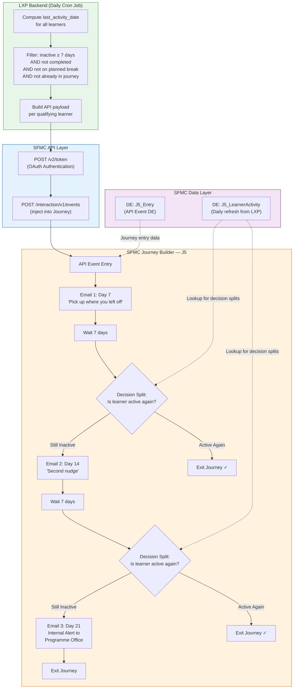
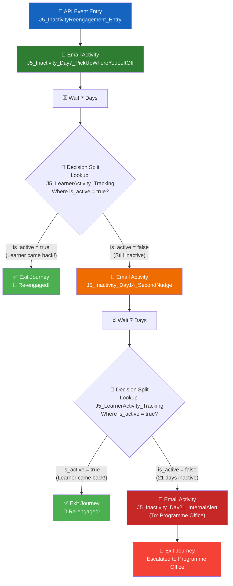

# J5: Inactivity Re-engagement — SFMC Implementation Blueprint

> **Project**: ISB LXP Journeys  
> **Journey**: J5 — Inactivity Re-engagement  
> **Architecture Pattern**: Same as J3 (API Event Entry via `/interaction/v1/events`)  
> **Date**: 25 August 2026  

---

## 1. Executive Summary

J5 re-engages learners who go quiet mid-programme. When a learner has **no platform activity for 7 days**, the LXP backend fires an API event into SFMC, injecting them into a **21-day re-engagement journey** with two learner-facing emails and one internal escalation alert.

### Key Difference from J3

| Aspect | J3 — Live Session Reminders | J5 — Inactivity Re-engagement |
|--------|----------------------------|-------------------------------|
| **Trigger timing** | Event-driven (session scheduled) | Batch/scheduled (daily inactivity check) |
| **Journey duration** | Short (~24 hours) | Long (up to 21 days) |
| **Messages** | 2 emails (24h + 1h before) | 2 learner emails + 1 internal alert |
| **Exit condition** | Session starts | Learner becomes active again |
| **Re-entry control** | Per-session (natural) | 14-day cooldown enforced |
| **Data freshness** | Near-real-time (reschedules) | Daily refresh is sufficient |

---

## 2. Architecture Overview



---

## 3. Installed Package (API Integration Setup)

> [!TIP]
> **Reuse the existing J3 Installed Package.** Since you already have "API Entry Event LXP" configured with Server-to-Server auth, the same Client ID / Client Secret can be used for J5. No new package is needed — just ensure the scopes include **Journeys: Read/Write** and **Data Extensions: Read/Write**.

If you prefer a **separate package** for isolation, create a new one with these settings:

| Field | Value |
|-------|-------|
| Package Name | `API Entry Event LXP - J5 Inactivity` |
| Package Type | Custom API Integration (Server-to-Server) |
| Scopes | Offline Access, Journeys: Read/Write, Data Extensions: Read/Write, List and Subscribers: Read/Write |
| Auth Base URI | *(same SFMC instance)* |
| REST Base URI | *(same SFMC instance)* |

---

## 4. Data Extensions

### 4.1 DE #1: `J5_InactivityReengagement_Entry` (API Event DE)

This is the **primary Data Extension** linked to the API Event in Journey Builder. It receives the payload when a learner is injected into the journey.

| API Payload Attribute | DE Field Name | Data Type | Length | Primary Key | Required | Notes |
|----------------------|---------------|-----------|--------|-------------|----------|-------|
| `ContactKey` | `ContactKey` | Text | 254 | — | ✅ | Contact Identifier (= userid) |
| `userid` | `userid` | Text | 254 | ✅ | ✅ | SubscriberKey — unique learner ID |
| `email` | `email` | EmailAddress | 254 | — | ✅ | Learner's email address |
| `name` | `name` | Text | 255 | — | ✅ | Learner's display name |
| `last_activity_date` | `last_activity_date` | Date | — | — | ✅ | Date of last platform activity |
| `days_inactive` | `days_inactive` | Number | — | — | ✅ | Number of days inactive (should be 7 at entry) |
| `progress_percentage` | `progress_percentage` | Number | — | — | — | Overall course progress (e.g., 45) |
| `last_accessed_course_name` | `last_accessed_course_name` | Text | 500 | — | — | Name of the last course accessed |
| `last_accessed_course_url` | `last_accessed_course_url` | Text | 1000 | — | — | Deep link URL to last accessed course |
| `cohort_name` | `cohort_name` | Text | 255 | — | — | Learner's cohort name |
| `programme_name` | `programme_name` | Text | 255 | — | — | Programme name |
| `subject` | `subject` | Text | 500 | — | — | Custom email subject line (optional override) |

> [!IMPORTANT]
> **`ContactKey` and `userid` must have the same value** — this is the pattern established in J3. The `userid` serves as the `SubscriberKey` for email sending.

---

### 4.2 DE #2: `J5_LearnerActivity_Tracking` (Daily Refresh DE)

This Data Extension is **updated daily by the LXP backend** (separate from the journey entry call). Journey Builder's **Decision Splits** will look up this DE to check if a learner has become active again since entering the journey.

| Field Name | Data Type | Length | Primary Key | Notes |
|-----------|-----------|--------|-------------|-------|
| `userid` | Text | 254 | ✅ | Matches the journey entry userid |
| `email` | EmailAddress | 254 | — | |
| `last_activity_date` | Date | — | — | Updated daily by LXP backend |
| `is_active` | Boolean | — | — | `true` if activity within last 7 days |
| `progress_percentage` | Number | — | — | Latest progress |
| `last_accessed_course_name` | Text | 500 | — | Latest course name |
| `last_accessed_course_url` | Text | 1000 | — | Latest course deep link |
| `is_completed` | Boolean | — | — | `true` if learner completed programme |
| `is_on_break` | Boolean | — | — | `true` if cohort is on planned break |
| `updated_at` | Date | — | — | Timestamp of last DE update |

> [!NOTE]
> **Why two DEs?** DE #1 is the snapshot at journey entry time (immutable per contact). DE #2 is the living, daily-refreshed data that decision splits query to determine if the learner has returned. This is the same separation pattern — entry data vs. lookup data.

---

### 4.3 DE #3: `J5_InternalAlerts_Log` (Optional — for Day 21 Alerts)

Logs all day-21 escalation alerts sent to the programme office for reporting.

| Field Name | Data Type | Length | Primary Key | Notes |
|-----------|-----------|--------|-------------|-------|
| `alert_id` | Text | 50 | ✅ | Auto-generated unique ID |
| `userid` | Text | 254 | — | Learner who triggered the alert |
| `email` | EmailAddress | 254 | — | |
| `name` | Text | 255 | — | |
| `days_inactive` | Number | — | — | Should be 21 at alert time |
| `cohort_name` | Text | 255 | — | |
| `programme_name` | Text | 255 | — | |
| `alert_sent_date` | Date | — | — | When the internal alert was sent |

---

## 5. Email Templates (Content Builder)

Create **three email templates** in Content Builder:

### 5.1 Email 1: Day 7 — "Pick Up Where You Left Off"

| Field | Value |
|-------|-------|
| Template Name | `J5_Inactivity_Day7_PickUpWhereYouLeftOff` |
| Subject Line | `%%subject%%` or default: `Hey %%name%%, your learning is waiting for you` |
| Preheader | `You're %%progress_percentage%%% through — don't lose momentum` |

**Content should include:**
- Personalized greeting using `%%name%%`
- Progress indicator showing `%%progress_percentage%%`%
- Last accessed course name: `%%last_accessed_course_name%%`
- CTA button deep-linking to `%%last_accessed_course_url%%`
- Encouraging tone — "Pick up where you left off"

**AMPscript block (top of email):**
```
%%[
SET @name = AttributeValue("name")
SET @progress = AttributeValue("progress_percentage")
SET @courseName = AttributeValue("last_accessed_course_name")
SET @courseURL = AttributeValue("last_accessed_course_url")
SET @subject = AttributeValue("subject")
SET @programme = AttributeValue("programme_name")

IF EMPTY(@name) THEN
  SET @name = "Learner"
ENDIF

IF EMPTY(@progress) THEN
  SET @progress = "0"
ENDIF
]%%
```

---

### 5.2 Email 2: Day 14 — "Second Nudge"

| Field | Value |
|-------|-------|
| Template Name | `J5_Inactivity_Day14_SecondNudge` |
| Subject Line | `%%name%%, it's been 2 weeks — your cohort is moving ahead` |
| Preheader | `A quick 15-minute session can get you back on track` |

**Content should include:**
- Stronger urgency tone — "Your cohort is progressing"
- Updated progress (from lookup to `J5_LearnerActivity_Tracking` DE)
- Deep link to last accessed course
- Social proof or cohort progress comparison (optional)

**AMPscript block (Day 14 — with DE lookup for fresh data):**
```
%%[
SET @userid = AttributeValue("userid")

/* Lookup fresh data from tracking DE */
SET @freshProgress = Lookup("J5_LearnerActivity_Tracking", "progress_percentage", "userid", @userid)
SET @freshCourseName = Lookup("J5_LearnerActivity_Tracking", "last_accessed_course_name", "userid", @userid)
SET @freshCourseURL = Lookup("J5_LearnerActivity_Tracking", "last_accessed_course_url", "userid", @userid)
SET @name = AttributeValue("name")

/* Use fresh data if available, otherwise fall back to entry data */
IF NOT EMPTY(@freshProgress) THEN
  SET @progress = @freshProgress
ELSE
  SET @progress = AttributeValue("progress_percentage")
ENDIF

IF NOT EMPTY(@freshCourseName) THEN
  SET @courseName = @freshCourseName
ELSE
  SET @courseName = AttributeValue("last_accessed_course_name")
ENDIF

IF NOT EMPTY(@freshCourseURL) THEN
  SET @courseURL = @freshCourseURL
ELSE
  SET @courseURL = AttributeValue("last_accessed_course_url")
ENDIF
]%%
```

---

### 5.3 Email 3: Day 21 — "Internal Alert to Programme Office"

| Field | Value |
|-------|-------|
| Template Name | `J5_Inactivity_Day21_InternalAlert` |
| **To Address** | `[programme-office@isb.edu]` ← **Confirm this address** |
| Subject Line | `[ACTION REQUIRED] Learner %%name%% inactive for 21 days` |

> [!WARNING]
> This email is **NOT** sent to the learner. It's an **internal alert** to the programme office. This requires a different "From/To" setup in the journey send activity. See Section 6 for how to configure this.

**Content should include:**
- Learner name, email, cohort, programme
- Days inactive (21)
- Progress percentage
- Last accessed course
- Suggested action for the programme office

---

## 6. Journey Builder Setup — Step by Step

### 6.1 Create the API Event

1. Go to **Journey Builder → Entry Sources → Create New Event**
2. Select **API Event**
3. Link it to the Data Extension: `J5_InactivityReengagement_Entry`
4. Note the generated **Event Definition Key** (e.g., `APIEvent-xxxx-xxxx-xxxx-xxxxxxxxxxxx`)

### 6.2 Journey Configuration

| Setting | Value |
|---------|-------|
| Journey Name | `J5 — Inactivity Re-engagement` |
| Entry Source | API Event (created in 6.1) |
| Re-entry | **Re-entry only after exiting** |
| Re-entry wait period | **14 days** ← Enforces the "no double nudge in a month" rule |
| Contact Entry Mode | Entry only (no update) |
| Goal | *(Optional)* Set a Goal to track re-activation rate |

### 6.3 Journey Canvas — Detailed Flow



### 6.4 Configuring Each Canvas Step

#### Step 1: API Event Entry
- Link to `J5_InactivityReengagement_Entry` DE
- All payload attributes auto-map

#### Step 2: Email 1 — Day 7 Nudge
- Select template: `J5_Inactivity_Day7_PickUpWhereYouLeftOff`
- From Name: `[Confirm — e.g., "ISB Learning"]`
- From Address: `[Confirm — e.g., learning@isb.edu]`
- Reply-To: `[Confirm]`

#### Step 3: Wait Activity — 7 Days
- Duration: 7 days
- Type: Duration-based wait

#### Step 4: Decision Split — "Is Learner Active?"
- **Condition**: Contact Data → Lookup `J5_LearnerActivity_Tracking` where `userid` matches journey contact's `userid`
- **Branch "Active"**: `is_active` = `true`
- **Branch "Still Inactive"**: `is_active` = `false` (or all others)

> [!IMPORTANT]
> **This is the critical step** that makes J5 different from J3. The decision split performs a **real-time lookup** against the daily-refreshed DE. This is why we need `J5_LearnerActivity_Tracking` to be updated every day by the LXP backend.

#### Step 5: Email 2 — Day 14 Second Nudge
- Select template: `J5_Inactivity_Day14_SecondNudge`
- Same From/Reply-To as Email 1

#### Step 6: Wait Activity — 7 Days
- Duration: 7 days

#### Step 7: Decision Split — "Is Learner Active?" (Same logic as Step 4)

#### Step 8: Email 3 — Day 21 Internal Alert
- Select template: `J5_Inactivity_Day21_InternalAlert`
- **To Address**: Programme office email (not the learner!)
- To achieve this, use one of these approaches:
  - **Option A**: Use AMPscript in the email to override `To` address
  - **Option B**: Create a separate send activity with the programme office address
  - **Option C (Recommended)**: Use an **Update Contact** activity before Email 3 to temporarily set the email to the programme office address, or use a **Custom Activity** to send via Triggered Send

---

## 7. Exit Criteria (Optional Enhancement)

In addition to the Decision Splits, you can configure **Journey-Level Exit Criteria**:

| Setting | Value |
|---------|-------|
| Exit Criteria | Contact attribute `is_active` in `J5_LearnerActivity_Tracking` = `true` |
| Evaluation frequency | Every time a contact is evaluated at a wait/decision |

> [!TIP]
> Using Exit Criteria means that even if a learner becomes active during the 7-day wait period (before hitting the Decision Split), they'll be ejected from the journey immediately. This provides a better experience than waiting for the decision split.

---

## 8. LXP Backend Integration — What to Build

The LXP backend needs **two daily API jobs**:

### 8.1 Job 1: Update Tracking DE (Runs Daily — e.g., 2:00 AM)

**Purpose**: Refresh the `J5_LearnerActivity_Tracking` DE with the latest learner activity data.

**SFMC API**: `POST /data/v1/async/dataextensions/key:{DE_External_Key}/rows`

```json
// Upsert rows into J5_LearnerActivity_Tracking
{
  "items": [
    {
      "userid": "learner_001",
      "email": "learner1@example.com",
      "last_activity_date": "2026-08-18T00:00:00Z",
      "is_active": false,
      "progress_percentage": 45,
      "last_accessed_course_name": "Digital Transformation Strategy",
      "last_accessed_course_url": "https://lxp.isb.edu/course/view.php?id=123",
      "is_completed": false,
      "is_on_break": false,
      "updated_at": "2026-08-25T02:00:00Z"
    }
  ]
}
```

### 8.2 Job 2: Inject Inactive Learners into Journey (Runs Daily — e.g., 3:00 AM)

**Purpose**: Identify learners who crossed the 7-day inactivity threshold TODAY and inject them into the J5 journey.

**Pre-flight checks (LXP side)**:
1. `last_activity_date` is exactly 7 days ago (or more, if first run)
2. Learner is NOT marked as `is_completed`
3. Learner's cohort is NOT on a planned break (`is_on_break = false`)
4. Learner is NOT currently in the J5 journey (check `J5_InactivityReengagement_Entry` or maintain a local state)

**SFMC API**: Same as J3 — `POST /interaction/v1/events`

```json
{
  "ContactKey": "learner_001",
  "EventDefinitionKey": "APIEvent-{your-J5-event-key}",
  "Data": {
    "userid": "learner_001",
    "email": "learner1@example.com",
    "name": "Rahul Sharma",
    "last_activity_date": "2026-08-18",
    "days_inactive": 7,
    "progress_percentage": 45,
    "last_accessed_course_name": "Digital Transformation Strategy",
    "last_accessed_course_url": "https://lxp.isb.edu/course/view.php?id=123",
    "cohort_name": "Cohort 12 - Aug 2026",
    "programme_name": "ISB Executive Programme",
    "subject": "Rahul, your learning is waiting for you"
  }
}
```

### 8.3 Authentication (Same as J3)

```
POST {Auth Base URI}/v2/token
Content-Type: application/json

{
  "grant_type": "client_credentials",
  "client_id": "p4rz87btz169z6ds4t2ajmmk",
  "client_secret": "SFM",
  "account_id": "546009908"
}
```

> [!CAUTION]
> **Never hardcode credentials in client-side code.** Store Client ID and Client Secret in environment variables or a secrets manager on the LXP backend server.

---

## 9. Postman Testing (Same Pattern as J3)

### 9.1 Step 1 — Generate Access Token

| Field | Value |
|-------|-------|
| Method | `POST` |
| Endpoint | `https://mcdbsftt7qmg3r7qdz3gd5pfxd7m.auth.marketingcloudapis.com/v2/token` |
| Body | `{ "grant_type": "client_credentials", "client_id": "...", "client_secret": "..." }` |

### 9.2 Step 2 — Trigger J5 Journey Entry

| Field | Value |
|-------|-------|
| Method | `POST` |
| Endpoint | `https://mcdbsftt7qmg3r7qdz3gd5pfxd7m.rest.marketingcloudapis.com/interaction/v1/events` |
| Headers | `Authorization: Bearer {access_token}`, `Content-Type: application/json` |
| Body | Full payload as shown in Section 8.2 |

### 9.3 Step 3 — Update Tracking DE (for testing Decision Splits)

To test that the Decision Split correctly detects a re-activated learner:

| Field | Value |
|-------|-------|
| Method | `PUT` |
| Endpoint | `{REST Base URI}/hub/v1/dataevents/key:{J5_LearnerActivity_Tracking_Key}/rows/userid:learner_001` |
| Body | `{ "values": { "is_active": true, "last_activity_date": "2026-08-25" } }` |

---

## 10. Day 21 Internal Alert — Implementation Options

The Day 21 email goes to the **programme office**, not to the learner. Here are three approaches:

### Option A: Separate Triggered Send Definition (Recommended)

1. Create a **Triggered Send Definition** in Email Studio targeting the programme office
2. In Journey Builder, use a **Custom Activity** or **Update Contact** + triggered send
3. The triggered send has the programme office email hardcoded as the recipient

### Option B: AMPscript Override in Email Template

Use AMPscript within the Day 21 email template to route the email:
```
%%[
/* This email should go to programme office */
/* The journey still sends to the learner's email, */
/* but the content addresses the programme office */
/* Consider BCC or forwarding approach */
]%%
```

### Option C: Automation Studio Triggered by Journey

1. At the Day 21 step, use an **Update Contact** activity to write the learner's data to `J5_InternalAlerts_Log`
2. Set up an **Automation Studio** automation that monitors `J5_InternalAlerts_Log` for new rows
3. Automation fires a **Send Email** activity to the programme office with the learner details

> [!IMPORTANT]
> **Recommended: Option A or C.** Option A is cleanest if you have a single programme office email. Option C is better if different cohorts have different programme managers.

---

## 11. Re-entry Control — 14-Day Cooldown

Journey Builder natively supports re-entry controls:

| Setting | Configuration |
|---------|--------------|
| **Allow re-entry** | Yes — "Re-entry only after exiting" |
| **Wait before re-entry** | 14 days |

This ensures:
- ✅ A learner who was re-engaged (exited via Decision Split) can re-enter if they go inactive again — but only after 14 days
- ✅ A learner who went through the full 21-day flow can re-enter — but only after 14 days from exit
- ✅ Nobody gets nudged twice in a month

> [!NOTE]
> The LXP backend should also maintain its own check — avoid re-injecting a learner who is currently in the journey. You can query the SFMC journey status API or maintain a local "in_journey" flag.

---

## 12. Measuring Success

### KPI: Share of nudged learners who come back within 7 days

**How to measure in SFMC:**

1. **Journey Analytics** → Track contacts that exit via the "Active" path at Decision Split 1 (came back within 7 days of Email 1)
2. **Custom Tracking DE** → Create a `J5_ReengagementResults` DE:

| Field | Type | Notes |
|-------|------|-------|
| `userid` | Text | |
| `journey_entry_date` | Date | When they entered J5 |
| `reactivation_date` | Date | When `is_active` flipped to `true` |
| `days_to_reactivate` | Number | `reactivation_date - journey_entry_date` |
| `exit_reason` | Text | `reactivated_day7`, `reactivated_day14`, `escalated_day21` |

3. **Reports** → Build a report:
   - **Re-engagement rate** = contacts exiting "Active" path / total contacts entered
   - **Time to re-engage** = average `days_to_reactivate`
   - **Escalation rate** = contacts reaching Day 21 / total contacts entered

---

## 13. Complete Implementation Checklist

### Phase 1: SFMC Setup
- [ ] Verify existing Installed Package scopes (add Data Extensions: Read/Write if needed)
- [ ] Create DE: `J5_InactivityReengagement_Entry`
- [ ] Create DE: `J5_LearnerActivity_Tracking`
- [ ] Create DE: `J5_InternalAlerts_Log` (optional)
- [ ] Create Email Template: `J5_Inactivity_Day7_PickUpWhereYouLeftOff`
- [ ] Create Email Template: `J5_Inactivity_Day14_SecondNudge`
- [ ] Create Email Template: `J5_Inactivity_Day21_InternalAlert`
- [ ] Create API Event in Journey Builder
- [ ] Build Journey canvas (Entry → Email 1 → Wait → Split → Email 2 → Wait → Split → Email 3)
- [ ] Configure re-entry: 14-day cooldown
- [ ] Configure exit criteria (optional)
- [ ] Set From Address and Reply-To

### Phase 2: LXP Backend Development
- [ ] Build daily cron job: compute `last_activity_date` per learner
- [ ] Build API integration: update `J5_LearnerActivity_Tracking` DE daily
- [ ] Build API integration: inject inactive learners into journey
- [ ] Implement exclusion logic (completed, on break, already in journey)
- [ ] Implement 7-day inactivity threshold detection

### Phase 3: Testing
- [ ] Test via Postman: authenticate + inject test contact
- [ ] Verify Email 1 is received
- [ ] Update tracking DE to simulate "still inactive" → verify Email 2
- [ ] Update tracking DE to simulate "active again" → verify journey exit
- [ ] Test Day 21 internal alert routing
- [ ] Test re-entry after 14 days
- [ ] Test exclusion of completed learners and cohorts on break

### Phase 4: Go Live
- [ ] Activate Journey in SFMC
- [ ] Enable LXP backend daily cron jobs
- [ ] Monitor first batch of injections
- [ ] Set up reporting dashboard

---

## 14. Open Questions — Need Confirmation

| # | Question | Impact |
|---|----------|--------|
| 1 | **From Address**: What email address and display name should the learner-facing emails come from? | Email send configuration |
| 2 | **Programme Office Email**: What email address(es) should receive the Day 21 internal alert? Is it one address or different per cohort? | Day 21 alert routing |
| 3 | **LXP Backend Ownership**: Who owns the LXP backend development? Is there an existing API layer, or does this need to be built from scratch? | Integration timeline |
| 4 | **Exclusion Data**: How will "completed learners" and "cohorts on planned break" be identified? Is this data already available in a structured format? | Filtering logic |
| 5 | **Email Content/Design**: Are there approved designs for the Day 7 and Day 14 emails, or should we create them? | Content Builder work |
| 6 | **userid Format**: Will the `userid` be the same format as used in J3? (LXP user ID, Moodle ID, etc.) | ContactKey mapping |
| 7 | **Re-entry Scope**: If a learner goes through the full 21-day journey and is escalated, should they ever re-enter J5 again? Or only learners who were re-engaged and then went inactive again? | Re-entry configuration |

---

## 15. Summary Comparison — J3 vs J5

| Component | J3 (Already Built) | J5 (To Build) |
|-----------|-------------------|---------------|
| Installed Package | ✅ Existing | ✅ Reuse same package |
| Data Extensions | 1 DE (API Event) | 2-3 DEs (Entry + Tracking + Alerts) |
| Email Templates | 2 (24h + 1h reminders) | 3 (Day 7 + Day 14 + Day 21 alert) |
| Journey Entry | API Event | API Event (same pattern) |
| Journey Logic | Linear (email → wait → email) | Branching (email → wait → **decision** → email/exit) |
| Wait Durations | Hours (24h, 1h) | Days (7, 14, 21) |
| Exit Criteria | Session starts (implicit) | Learner active again (explicit lookup) |
| Re-entry | Per-session | 14-day cooldown |
| External Data Dependency | Session schedule (near-real-time) | Activity tracking (daily refresh) |
| LXP Backend Jobs | 1 (inject on session schedule) | 2 (daily tracking update + daily injection) |

---

> [!TIP]
> **Quick Start**: If you want to do a quick POC (like J3), start with just the **Entry DE + Email 1 + Postman test**. Skip the Decision Splits and Day 14/21 emails initially. Once the basic flow works, add the tracking DE and branching logic.
