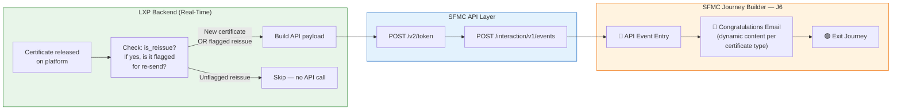
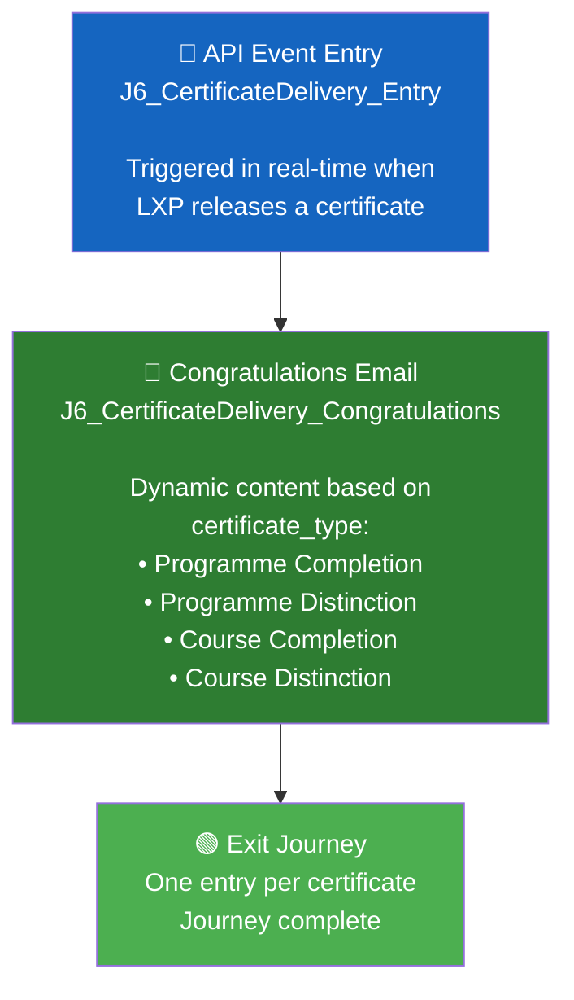

# LXP J6: Certificate Delivery — SFMC Implementation Document

> **Project**: ISB LXP Journeys  
> **Journey**: J6 — Certificate Delivery  
> **Architecture Pattern**: API Event Entry (same as J3 & J5)  
> **Date**: 26 August 2026  
> **Status**: Ready for Implementation (pending dependency — see Section 10)

---

## 1. Overview

Certificates are the payoff moment. This journey delivers them by email the moment they are earned.

When a certificate is released on the LXP platform, the backend fires an **API event in real-time** into SFMC. The journey sends a **single congratulations email** with a download CTA, then exits immediately. One entry per certificate.

| Field | Specification |
|-------|--------------|
| **Objective** | Deliver every earned certificate by email within minutes of release |
| **Who enters & when** | Any learner whose certificate is released on the platform, covering all four certificate types |
| **Certificate Types** | 1. Programme Completion  2. Programme Distinction  3. Course Completion  4. Course Distinction |
| **Messages we send** | One congratulations email per certificate, with a download CTA to the Accomplishments page |
| **When the journey ends** | Immediately after the email is sent — one entry per certificate |
| **Edge Case** | A re-issued certificate does NOT trigger a second email unless flagged intentionally |
| **Data needed** | Certificate released event from LXP backend: learner, certificate type, certificate name (real-time feed — new build) |
| **Dependency** | ⚠️ The trigger-based release fix must be live first, so wrongly released certificates never become wrongly sent emails |
| **Success Metric** | Share of certificates emailed within an hour of release, plus open and download rates |

---

## 2. How J6 Compares to J3 & J5

J6 is the **simplest journey** of the three — a straight-line, single-email, fire-and-forget pattern with no waits or decision splits.

| Aspect | J3 — Live Session Reminders | J5 — Inactivity Re-engagement | J6 — Certificate Delivery |
|--------|----------------------------|-------------------------------|---------------------------|
| **Trigger** | Event-driven (session scheduled) | Batch/daily (inactivity check) | **Real-time event** (certificate released) |
| **Journey Duration** | ~24 hours | Up to 21 days | **Instant** (seconds) |
| **Journey Logic** | Linear (2 emails + waits) | Branching (Decision Splits) | **Single email → exit** |
| **Emails** | 2 | 2 (+1 pending) | **1** |
| **Data Extensions** | 1 | 2 (entry + tracking) | **1** |
| **Contact Builder Linking** | Not needed | Required (Data Designer) | **Not needed** |
| **Decision Splits** | None | 2 | **None** |
| **Wait Activities** | Yes (24h, 1h) | Yes (7d, 7d) | **None** |
| **Re-entry** | Per-session | 14-day cooldown | **Immediate** (per certificate) |
| **LXP Backend Jobs** | 1 (inject on schedule) | 2 (daily tracking + injection) | **1** (real-time event fire) |
| **Complexity** | Medium | High | **Low** ⭐ |

---

## 3. Architecture Overview



---

## 4. Installed Package (API Integration Setup)

> [!TIP]
> **Reuse the existing J3/J5 Installed Package** — "API Entry Event LXP". Same Client ID / Client Secret. No new package needed.

| Field | Value |
|-------|-------|
| Package Name | API Entry Event LXP *(existing)* |
| Package Type | Custom API Integration (Server-to-Server) |
| Account ID | `546009908` |
| Client ID | `p4rz87btz169z6ds4t2ajmmk` |
| Client Secret | `******************************************************` |
| Auth Base URI | `https://mcdbsftt7qmg3r7qdz3gd5pfxd7m.auth.marketingcloudapis.com/` |
| REST Base URI | `https://mcdbsftt7qmg3r7qdz3gd5pfxd7m.rest.marketingcloudapis.com/` |
| SOAP Base URI | `https://mcdbsftt7qmg3r7qdz3gd5pfxd7m.soap.marketingcloudapis.com/` |

**Required Scopes** (should already be enabled from J3/J5):

| Scope | Required For |
|-------|-------------|
| Offline Access | Token generation |
| Journeys: Read, Write | Inject contacts into J6 journey |
| List and Subscribers: Read, Write | Subscriber management |

---

## 5. Data Extension

Only **one Data Extension** is needed for J6 — the API Event entry DE. No tracking DE or Contact Builder linking required (unlike J5).

### `J6_CertificateDelivery_Entry` (API Event DE)

| API Payload Attribute | DE Field Name | Data Type | Length | Primary Key | Required | Notes |
|----------------------|---------------|-----------|--------|:-----------:|:--------:|-------|
| `ContactKey` | `ContactKey` | Text | 254 | — | ✅ | Contact Identifier (= userid) |
| `userid` | `userid` | Text | 254 | — | ✅ | SubscriberKey — unique learner ID. Must match ContactKey. |
| `email` | `email` | EmailAddress | 254 | — | ✅ | Learner's email address |
| `name` | `name` | Text | 255 | — | ✅ | Learner's display name |
| `certificate_id` | `certificate_id` | Text | 254 | ✅ | ✅ | **Unique certificate identifier — prevents duplicate sends** |
| `certificate_type` | `certificate_type` | Text | 100 | — | ✅ | One of: `programme_completion`, `programme_distinction`, `course_completion`, `course_distinction` |
| `certificate_name` | `certificate_name` | Text | 500 | — | ✅ | Display name of the certificate |
| `course_name` | `course_name` | Text | 500 | — | — | Course name (for course-level certificates) |
| `programme_name` | `programme_name` | Text | 500 | — | — | Programme name (for programme-level certificates) |
| `accomplishments_url` | `accomplishments_url` | Text | 1000 | — | ✅ | Deep link to Accomplishments page where learner can download |
| `issued_date` | `issued_date` | Date | — | — | ✅ | Certificate issue timestamp |
| `is_reissue` | `is_reissue` | Boolean | — | — | — | `true` if this is an intentional re-issue (flagged for re-send) |
| `subject` | `subject` | Text | 500 | — | — | Custom email subject line (optional override) |

> [!IMPORTANT]
> **`certificate_id` is the Primary Key** — not `userid`. A single learner can earn multiple certificates, so each row represents one certificate, not one learner. If the same `certificate_id` is sent again (re-issued certificate without intentional flag), the DE will reject the duplicate insert, preventing double emails.

---

## 6. Deduplication — Preventing Double Emails on Re-issued Certificates

The spec states: *"A re-issued certificate does not trigger a second email unless flagged intentionally."*

This is handled at **two levels**:

### Level 1: LXP Backend (Primary Guard)

The LXP backend must check before firing the API event:

```
IF certificate is newly released:
    → Fire API event ✅

ELSE IF certificate is re-issued AND is_reissue_flagged = true:
    → Fire API event with is_reissue = true ✅
    → Use a NEW certificate_id (e.g., original_id + "_reissue_1")

ELSE IF certificate is re-issued AND NOT flagged:
    → Do NOT fire API event ❌
```

### Level 2: SFMC Data Extension (Safety Net)

Even if the LXP backend has a bug, the DE's **primary key on `certificate_id`** provides a safety net:

- If the same `certificate_id` is sent twice → SFMC returns an error (duplicate key) → no journey entry → no duplicate email
- For intentional re-issues, the LXP backend must generate a **new `certificate_id`** (e.g., `CERT-12345-R1`) so the DE accepts it as a new row

```
First issue:    certificate_id = "CERT-12345"       → ✅ Accepted → Email sent
Accidental dup: certificate_id = "CERT-12345"       → ❌ Rejected (duplicate PK)
Intentional:    certificate_id = "CERT-12345-R1"    → ✅ Accepted → Email sent
```

---

## 7. Email Template (Content Builder)

Create **one email template** with AMPscript conditional content that adapts based on `certificate_type`. One template is cleaner than four — less maintenance, consistent design.

### Template: `J6_CertificateDelivery_Congratulations`

| Field | Value |
|-------|-------|
| Template Name | `J6_CertificateDelivery_Congratulations` |
| Subject Line | Dynamic — see AMPscript below |
| Preheader | Dynamic — based on certificate type |

### AMPscript (top of email):

```
%%[

SET @name = AttributeValue("name")
SET @certType = AttributeValue("certificate_type")
SET @certName = AttributeValue("certificate_name")
SET @courseName = AttributeValue("course_name")
SET @programmeName = AttributeValue("programme_name")
SET @accomplishmentsURL = AttributeValue("accomplishments_url")
SET @subject = AttributeValue("subject")
SET @issuedDate = AttributeValue("issued_date")

/* Fallback */
IF EMPTY(@name) THEN
  SET @name = "Learner"
ENDIF

/* -----------------------------------------------------------
   Dynamic content based on certificate type
   ----------------------------------------------------------- */

IF @certType == "programme_completion" THEN
  SET @headline = CONCAT("Congratulations, ", @name, "! You've completed ", @programmeName)
  SET @subheadline = "Your Programme Completion Certificate is ready"
  SET @bodyText = CONCAT("You've successfully completed the ", @programmeName, " programme. This is a remarkable achievement — well done!")
  SET @ctaText = "Download Your Certificate"
  IF EMPTY(@subject) THEN
    SET @subject = CONCAT("🎓 Congratulations, ", @name, "! Your programme certificate is ready")
  ENDIF

ELSEIF @certType == "programme_distinction" THEN
  SET @headline = CONCAT("Outstanding, ", @name, "! You've earned a Distinction")
  SET @subheadline = CONCAT("Programme Distinction Certificate — ", @programmeName)
  SET @bodyText = CONCAT("You've completed the ", @programmeName, " programme with Distinction. Your dedication and excellence have truly set you apart!")
  SET @ctaText = "Download Your Distinction Certificate"
  IF EMPTY(@subject) THEN
    SET @subject = CONCAT("🏆 ", @name, ", you've earned a Distinction!")
  ENDIF

ELSEIF @certType == "course_completion" THEN
  SET @headline = CONCAT("Well done, ", @name, "! Course completed")
  SET @subheadline = CONCAT("Course Completion Certificate — ", @courseName)
  SET @bodyText = CONCAT("You've successfully completed ", @courseName, ". Your certificate is ready to download.")
  SET @ctaText = "Download Your Certificate"
  IF EMPTY(@subject) THEN
    SET @subject = CONCAT("✅ ", @name, ", your course certificate is ready")
  ENDIF

ELSEIF @certType == "course_distinction" THEN
  SET @headline = CONCAT("Exceptional work, ", @name, "! Course Distinction earned")
  SET @subheadline = CONCAT("Course Distinction Certificate — ", @courseName)
  SET @bodyText = CONCAT("You've completed ", @courseName, " with Distinction. An outstanding result!")
  SET @ctaText = "Download Your Distinction Certificate"
  IF EMPTY(@subject) THEN
    SET @subject = CONCAT("🌟 ", @name, ", you've earned a Course Distinction!")
  ENDIF

ELSE
  /* Fallback for unknown types */
  SET @headline = CONCAT("Congratulations, ", @name, "!")
  SET @subheadline = "Your certificate is ready"
  SET @bodyText = CONCAT("Your certificate — ", @certName, " — is ready to download.")
  SET @ctaText = "Download Your Certificate"
  IF EMPTY(@subject) THEN
    SET @subject = CONCAT("🎓 ", @name, ", your certificate is ready")
  ENDIF

ENDIF

]%%
```

### Email Body (HTML):

```html
<h1>%%=v(@headline)=%%</h1>

<p style="font-size:16px; color:#555;">%%=v(@subheadline)=%%</p>

<p>%%=v(@bodyText)=%%</p>

<p><strong>Certificate:</strong> %%=v(@certName)=%%</p>
<p><strong>Issued:</strong> %%=FormatDate(@issuedDate, "DD MMMM YYYY")=%%</p>

<div style="text-align:center; margin:32px 0;">
  <a href="%%=RedirectTo(@accomplishmentsURL)=%%" 
     style="background-color:#0066CC; color:#fff; padding:14px 28px; 
            text-decoration:none; border-radius:4px; font-size:16px; font-weight:bold;">
     %%=v(@ctaText)=%%
  </a>
</div>

<p style="color:#888; font-size:13px;">
  You can view and download all your certificates anytime from your 
  <a href="%%=RedirectTo(@accomplishmentsURL)=%%">Accomplishments page</a>.
</p>
```

> [!NOTE]
> **One template, four experiences.** The AMPscript conditionals change the headline, body text, CTA label, and subject line based on `certificate_type`. The email design/layout stays consistent across all four types. If the client later wants completely different designs per type, we can split into four templates with a Decision Split in the journey.

---

## 8. Journey Builder Setup

### 8.1 Create the API Event

1. Go to **Journey Builder → Entry Sources → Create New Event**
2. Select **API Event**
3. Link it to Data Extension: `J6_CertificateDelivery_Entry`
4. Save and note the generated **Event Definition Key**
   - Format: `APIEvent-xxxxxxxx-xxxx-xxxx-xxxx-xxxxxxxxxxxx`

### 8.2 Journey Settings

| Setting | Value |
|---------|-------|
| Journey Name | `J6 — Certificate Delivery` |
| Entry Source | API Event (from 8.1) |
| Contact Entry | **Re-entry anytime** |
| Re-entry wait period | **No wait** (a learner can earn multiple certificates in quick succession) |

> [!IMPORTANT]
> **Re-entry must be set to "Re-entry anytime"** — a single learner can earn multiple certificates (e.g., a course completion and a programme completion on the same day). Each certificate is a separate journey entry. The `certificate_id` PK in the DE ensures uniqueness per certificate, not per learner.

### 8.3 Journey Canvas

This is the simplest possible journey — just two steps:



### 8.4 Configuring Each Step

#### Step 1 — API Event Entry
- Linked to `J6_CertificateDelivery_Entry` DE
- All payload attributes auto-map

#### Step 2 — Email (Congratulations)
- Template: `J6_CertificateDelivery_Congratulations`
- From Name: `[Need to Confirm — e.g., "ISB Learning"]`
- From Address: `[Need to Confirm]`
- Reply-To: `[Need to Confirm]`

**No Wait Activities. No Decision Splits. No branching.**

The email fires within seconds of the API event. The journey ends immediately after.

---

## 9. LXP Backend Integration

The LXP backend needs **one real-time API call** — fired the moment a certificate is released.

### 9.1 Authentication (Same as J3/J5)

```
POST https://mcdbsftt7qmg3r7qdz3gd5pfxd7m.auth.marketingcloudapis.com/v2/token
Content-Type: application/json

{
  "grant_type": "client_credentials",
  "client_id": "p4rz87btz169z6ds4t2ajmmk",
  "client_secret": "*******************************************",
  "account_id": "546009908"
}
```

> [!TIP]
> **Token caching:** The access token is valid for 1080 seconds (18 minutes). The LXP backend should cache the token and reuse it for multiple certificate events within that window, rather than requesting a new token per certificate.

### 9.2 Fire Certificate Event (Real-Time)

**Trigger:** The moment a certificate is released on the LXP platform.

**Pre-flight checks (LXP side):**

- [x] Certificate has been released (not just generated/pending)
- [x] The trigger-based release fix is live (dependency — see Section 10)
- [x] Certificate is NOT a re-issue, OR it IS a re-issue that has been intentionally flagged for re-send
- [x] If intentional re-issue: generate a new `certificate_id` (e.g., append `-R1`)

**API Endpoint:**

```
POST {REST Base URI}/interaction/v1/events
Authorization: Bearer {access_token}
Content-Type: application/json
```

**Payload — Programme Completion Example:**

```json
{
  "ContactKey": "learner_001",
  "EventDefinitionKey": "APIEvent-{your-J6-event-definition-key}",
  "Data": {
    "userid": "learner_001",
    "email": "rahul@gmail.com",
    "name": "Rahul Sharma",
    "certificate_id": "CERT-PROG-2026-00451",
    "certificate_type": "programme_completion",
    "certificate_name": "ISB Executive Programme - Certificate of Completion",
    "course_name": "",
    "programme_name": "ISB Executive Programme",
    "accomplishments_url": "https://lxp.isb.edu/user/accomplishments.php?userid=learner_001",
    "issued_date": "2026-08-26T12:30:00Z",
    "is_reissue": false,
    "subject": ""
  }
}
```

**Payload — Course Distinction Example:**

```json
{
  "ContactKey": "learner_002",
  "EventDefinitionKey": "APIEvent-{your-J6-event-definition-key}",
  "Data": {
    "userid": "learner_002",
    "email": "priya@gmail.com",
    "name": "Priya Patel",
    "certificate_id": "CERT-CDIST-2026-00782",
    "certificate_type": "course_distinction",
    "certificate_name": "Digital Transformation Strategy - Distinction",
    "course_name": "Digital Transformation Strategy",
    "programme_name": "ISB Executive Programme",
    "accomplishments_url": "https://lxp.isb.edu/user/accomplishments.php?userid=learner_002",
    "issued_date": "2026-08-26T14:15:00Z",
    "is_reissue": false,
    "subject": ""
  }
}
```

**Payload — Intentional Re-issue Example:**

```json
{
  "ContactKey": "learner_001",
  "EventDefinitionKey": "APIEvent-{your-J6-event-definition-key}",
  "Data": {
    "userid": "learner_001",
    "email": "rahul@gmail.com",
    "name": "Rahul Sharma",
    "certificate_id": "CERT-PROG-2026-00451-R1",
    "certificate_type": "programme_completion",
    "certificate_name": "ISB Executive Programme - Certificate of Completion",
    "course_name": "",
    "programme_name": "ISB Executive Programme",
    "accomplishments_url": "https://lxp.isb.edu/user/accomplishments.php?userid=learner_001",
    "issued_date": "2026-08-26T16:00:00Z",
    "is_reissue": true,
    "subject": ""
  }
}
```

> Note the `certificate_id` has `-R1` appended. This allows it to pass the DE primary key check and trigger a new email.

### 9.3 `certificate_type` Values (Enum)

The LXP backend must send one of these exact values:

| Value | Certificate Type |
|-------|-----------------|
| `programme_completion` | Programme Completion |
| `programme_distinction` | Programme Distinction |
| `course_completion` | Course Completion |
| `course_distinction` | Course Distinction |

> [!WARNING]
> These values must match exactly — the AMPscript conditionals in the email template compare against these strings. Any typo or casing difference will fall through to the generic fallback content.

---

## 10. Dependency ⚠️

> [!CAUTION]
> **The trigger-based release fix must be live on the LXP platform BEFORE J6 goes live.**
>
> The spec states: *"The trigger based release fix must be live first, so wrongly released certificates never become wrongly sent emails."*
>
> **What this means:** If the LXP platform currently has a bug where certificates are sometimes released incorrectly (e.g., before the learner actually qualifies), those false releases would trigger congratulations emails — embarrassing and damaging to trust.
>
> **J6 can be fully built, configured, and tested in SFMC** while the release fix is being developed. But the journey must remain in **TEST mode** until the fix is confirmed live. Only then should J6 be activated for production.

---

## 11. Testing via Postman

### 11.1 Step 1 — Generate Access Token

| Field | Value |
|-------|-------|
| Method | `POST` |
| URL | `https://mcdbsftt7qmg3r7qdz3gd5pfxd7m.auth.marketingcloudapis.com/v2/token` |
| Body (raw JSON) | `{ "grant_type": "client_credentials", "client_id": "...", "client_secret": "..." }` |

### 11.2 Step 2 — Inject Test Certificate (Programme Completion)

| Field | Value |
|-------|-------|
| Method | `POST` |
| URL | `https://mcdbsftt7qmg3r7qdz3gd5pfxd7m.rest.marketingcloudapis.com/interaction/v1/events` |
| Headers | `Authorization: Bearer {access_token}`, `Content-Type: application/json` |

```json
{
  "ContactKey": "test_user_001",
  "EventDefinitionKey": "APIEvent-{your-J6-event-definition-key}",
  "Data": {
    "userid": "test_user_001",
    "email": "testuser@example.com",
    "name": "Test User",
    "certificate_id": "TEST-CERT-001",
    "certificate_type": "programme_completion",
    "certificate_name": "ISB Executive Programme - Certificate of Completion",
    "course_name": "",
    "programme_name": "ISB Executive Programme",
    "accomplishments_url": "https://lxp.isb.edu/user/accomplishments.php?userid=test_user_001",
    "issued_date": "2026-08-26T12:00:00Z",
    "is_reissue": false,
    "subject": ""
  }
}
```

**Expected:** Congratulations email received with Programme Completion content.

### 11.3 Step 3 — Test All Four Certificate Types

Repeat Step 2 with different `certificate_type` values and unique `certificate_id`s:

| Test | certificate_type | certificate_id | Expected Subject |
|------|-----------------|----------------|-----------------|
| 1 | `programme_completion` | `TEST-CERT-001` | 🎓 Congratulations, Test User! Your programme certificate is ready |
| 2 | `programme_distinction` | `TEST-CERT-002` | 🏆 Test User, you've earned a Distinction! |
| 3 | `course_completion` | `TEST-CERT-003` | ✅ Test User, your course certificate is ready |
| 4 | `course_distinction` | `TEST-CERT-004` | 🌟 Test User, you've earned a Course Distinction! |

### 11.4 Step 4 — Test Deduplication (Re-issued Certificate)

Send the **same `certificate_id`** again:

```json
{
  "ContactKey": "test_user_001",
  "EventDefinitionKey": "APIEvent-{your-J6-event-definition-key}",
  "Data": {
    "userid": "test_user_001",
    "email": "testuser@example.com",
    "name": "Test User",
    "certificate_id": "TEST-CERT-001",
    ...
  }
}
```

**Expected:** SFMC returns an error (duplicate primary key). No email sent. ✅

### 11.5 Step 5 — Test Intentional Re-issue

Send with a **new `certificate_id`** (appended `-R1`):

```json
{
  "ContactKey": "test_user_001",
  "EventDefinitionKey": "APIEvent-{your-J6-event-definition-key}",
  "Data": {
    "userid": "test_user_001",
    "email": "testuser@example.com",
    "name": "Test User",
    "certificate_id": "TEST-CERT-001-R1",
    "is_reissue": true,
    ...
  }
}
```

**Expected:** Email sent again (new certificate_id accepted). ✅

### 11.6 Testing Checklist

| # | Test | Expected Result | ✓ |
|---|------|----------------|---|
| 1 | Programme Completion certificate | Correct congratulations email with programme content | ☐ |
| 2 | Programme Distinction certificate | Correct email with distinction content + stronger tone | ☐ |
| 3 | Course Completion certificate | Correct email with course name | ☐ |
| 4 | Course Distinction certificate | Correct email with course distinction content | ☐ |
| 5 | Duplicate `certificate_id` (unflagged re-issue) | SFMC rejects — no duplicate email | ☐ |
| 6 | New `certificate_id` with `-R1` (intentional re-issue) | Email sent successfully | ☐ |
| 7 | Multiple certificates for same learner (different IDs) | All emails sent — re-entry works | ☐ |
| 8 | CTA button links to Accomplishments page | Correct URL opens | ☐ |
| 9 | Unknown `certificate_type` value | Fallback/generic email content renders | ☐ |

---

## 12. Complete Setup Order

```
Phase 1: SFMC Data Layer
├── 1.  Verify Installed Package scopes (should be set from J3/J5)
└── 2.  Create DE: J6_CertificateDelivery_Entry (PK = certificate_id)

Phase 2: SFMC Content
└── 3.  Create Email: J6_CertificateDelivery_Congratulations
         (with AMPscript conditionals for all 4 certificate types)

Phase 3: SFMC Journey
├── 4.  Create API Event → link to J6_CertificateDelivery_Entry DE
├── 5.  Build journey canvas: Entry → Email → Exit
├── 6.  Configure re-entry: "Re-entry anytime" with no wait
├── 7.  Configure From Address / Reply-To (once confirmed)
└── 8.  Set journey to TEST mode

Phase 4: Testing
├── 9.  Test all 4 certificate types via Postman
├── 10. Test deduplication (duplicate certificate_id rejected)
├── 11. Test intentional re-issue (new certificate_id accepted)
└── 12. Test multiple certificates for same learner

Phase 5: LXP Backend
├── 13. Build real-time certificate event trigger
├── 14. Implement deduplication logic (re-issue check)
├── 15. Implement certificate_id generation
└── 16. ⚠️  Confirm trigger-based release fix is live

Phase 6: Go Live
├── 17. Confirm release fix is deployed and tested on LXP
├── 18. Activate journey (move from TEST to ACTIVE)
├── 19. Monitor first batch of certificate emails
└── 20. Set up reporting (email within 1 hour of release, open rates, download rates)
```

---

## 13. Open Questions — Need Confirmation

| # | Question | Impact | Status |
|---|----------|--------|--------|
| 1 | **From Address**: What email address and display name for certificate emails? | Email send config | ⏳ Pending |
| 2 | **Reply-To Address**: Where should learner replies go? | Email send config | ⏳ Pending |
| 3 | **Email Design**: Is there an approved design/creative for the certificate congratulations email? Or should we build one? | Content Builder | ⏳ Pending |
| 4 | **Accomplishments URL format**: What is the exact URL pattern for the Accomplishments page? | CTA deep link | ⏳ Pending |
| 5 | **certificate_id format**: What format will the LXP backend use? (e.g., `CERT-PROG-2026-00451`) | DE primary key + dedup | ⏳ Pending |
| 6 | **Release fix status**: When is the trigger-based release fix expected to go live? | ⚠️ Blocks go-live | ⏳ Pending |
| 7 | **One template or four**: Does the client want the same email layout for all 4 types, or different designs per type? | Template architecture | ⏳ Pending |
| 8 | **Re-issue flag**: How will the LXP team flag an intentional re-issue? (Admin UI toggle? API parameter?) | Deduplication flow | ⏳ Pending |

---

## 14. Comparison — All Journeys Summary

| Component | J3 ✅ | J5 🔨 | J6 🔨 |
|-----------|-------|-------|-------|
| **Name** | Live Session Reminders | Inactivity Re-engagement | Certificate Delivery |
| **Status** | POC Done | Ready to Build | Ready to Build (pending dependency) |
| **Installed Package** | Existing | Reuse | Reuse |
| **Data Extensions** | 1 | 2 | **1** |
| **Contact Builder** | No | Yes (Data Designer) | **No** |
| **Email Templates** | 2 | 2 | **1** (with conditional content) |
| **Journey Logic** | Linear | Branching | **Single step** |
| **Wait Activities** | 2 | 2 | **None** |
| **Decision Splits** | 0 | 2 | **None** |
| **LXP Backend Jobs** | 1 (event) | 2 (daily batch) | **1** (real-time event) |
| **Re-entry** | Per-session | 14-day cooldown | **Anytime** (per certificate) |
| **Complexity** | Medium | High | **Low ⭐** |
| **Blockers** | None | Day 21 alert routing | Release fix dependency |
