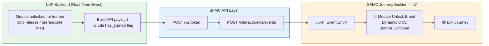
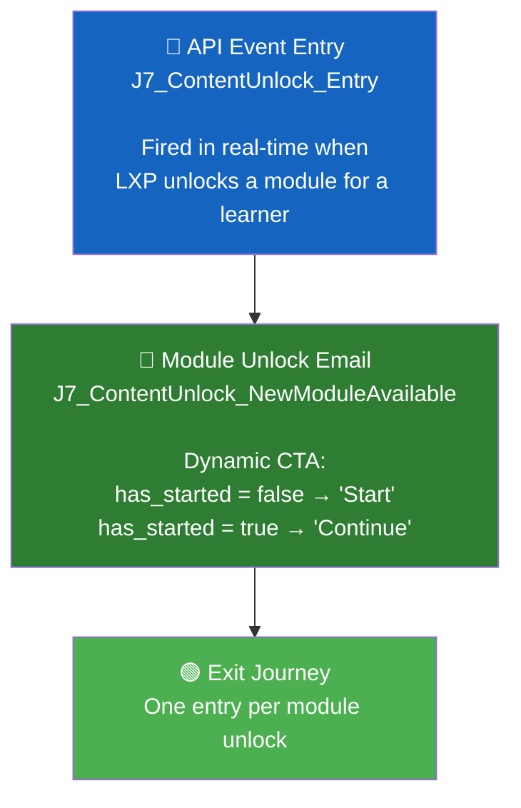

# LXP J7: New Course / Content Unlock — SFMC Implementation Document

> **Project**: ISB LXP Journeys  
> **Journey**: J7 — New Course / Content Unlock  
> **Architecture Pattern**: API Event Entry (same as J3, J5, J6)  
> **Date**: 26 August 2026  
> **Status**: Ready for Implementation

---

## 1. Overview

New content should not sit unnoticed. This journey tells learners the moment a module unlocks.

When a module is unlocked for a learner (via Moodle drip release or prerequisites), the LXP backend fires an **API event in real-time** into SFMC. The journey sends a **single notification email** with a dynamic CTA, then exits immediately. One entry per module unlock.

| Field | Specification |
|-------|--------------|
| **Objective** | Get learners to start newly unlocked Course quickly |
| **Who enters & when** | Every learner in the cohort when a Course unlocks for them |
| **Trigger source** | Module unlock events from Moodle drip release and prerequisites (same trigger as the in-app module unlocked notification) |
| **Messages we send** | One email per module unlock, nobody is skipped. CTA reads **"Start"** for learners who have not opened it yet, and **"Continue"** for those already in it. |
| **When the journey ends** | Immediately after the email — one entry per module unlock |
| **Data needed** | Module unlock events with module name and cohort mapping from LXP backend, sent within the hour of unlock, plus a **per-learner started flag** to pick the right CTA |
| **Success Metric** | Share of learners starting the module within 48 hours of the email |

---

## 2. How J7 Compares to Other Journeys

J7 follows the **exact same pattern as J6** — single email, real-time event, instant exit. The only addition is the **conditional CTA** based on the `has_started` flag.

| Aspect | J3 | J5 | J6 | **J7** |
|--------|----|----|----|----|
| **Type** | Session Reminders | Inactivity Re-engagement | Certificate Delivery | **Content Unlock** |
| **Trigger** | Event (session scheduled) | Daily batch (inactivity) | Real-time (certificate released) | **Real-time (module unlocked)** |
| **Duration** | ~24 hours | Up to 21 days | Instant | **Instant** |
| **Emails** | 2 | 2 | 1 | **1** |
| **Logic** | Linear (2 waits) | Branching (Decision Splits) | Single step | **Single step** |
| **Data Extensions** | 1 | 2 | 1 | **1** |
| **Contact Builder** | No | Yes | No | **No** |
| **Special Feature** | — | Decision Splits + tracking DE | Conditional content (cert type) | **Conditional CTA (Start/Continue)** |
| **Re-entry** | Per-session | 14-day cooldown | Anytime (per certificate) | **Anytime (per module)** |
| **Complexity** | Medium | High | Low | **Low ⭐** |

---

## 3. Architecture Overview



---

## 4. Installed Package (API Integration Setup)

> [!TIP]
> **Reuse the existing Installed Package** — "API Entry Event LXP". Same Client ID / Client Secret used for J3, J5, J6. No new package needed.

| Field | Value |
|-------|-------|
| Package Name | API Entry Event LXP *(existing)* |
| Account ID | `546009908` |
| Client ID | `p4rz87btz169z6ds4t2ajmmk` |
| Client Secret | `SFMC_m7RYKi_603hp4FDtqUXSpbkKLUG3cM8RVKO4wZEfpdiL3q8hfPV47cddbaf` |
| Auth Base URI | `https://mcdbsftt7qmg3r7qdz3gd5pfxd7m.auth.marketingcloudapis.com/` |
| REST Base URI | `https://mcdbsftt7qmg3r7qdz3gd5pfxd7m.rest.marketingcloudapis.com/` |

---

## 5. Data Extension

Only **one Data Extension** is needed — the API Event entry DE.

### `J7_ContentUnlock_Entry` (API Event DE)

| API Payload Attribute | DE Field Name | Data Type | Length | Primary Key | Required | Notes |
|----------------------|---------------|-----------|--------|:-----------:|:--------:|-------|
| `ContactKey` | `ContactKey` | Text | 254 | — | ✅ | Contact Identifier (= userid) |
| `userid` | `userid` | Text | 254 | — | ✅ | SubscriberKey — must match ContactKey |
| `email` | `email` | EmailAddress | 254 | — | ✅ | Learner's email address |
| `name` | `name` | Text | 255 | — | ✅ | Learner's display name |
| `module_unlock_id` | `module_unlock_id` | Text | 254 | ✅ | ✅ | **Unique ID per unlock event** (prevents duplicate emails) |
| `module_name` | `module_name` | Text | 500 | — | ✅ | Name of the unlocked module/course |
| `module_url` | `module_url` | Text | 1000 | — | ✅ | Deep link to the module on LXP |
| `module_type` | `module_type` | Text | 100 | — | — | e.g., `course`, `activity`, `resource` |
| `has_started` | `has_started` | Boolean | — | — | ✅ | `true` = learner already started this module, `false` = not yet opened. **Drives the CTA text.** |
| `cohort_name` | `cohort_name` | Text | 255 | — | — | Learner's cohort name |
| `programme_name` | `programme_name` | Text | 255 | — | — | Programme name |
| `unlock_reason` | `unlock_reason` | Text | 100 | — | — | `drip_release` or `prerequisite_met` |
| `unlocked_at` | `unlocked_at` | Date | — | — | ✅ | Timestamp when the module was unlocked |
| `subject` | `subject` | Text | 500 | — | — | Custom email subject line (optional override) |

> [!IMPORTANT]
> **`module_unlock_id` is the Primary Key** — not `userid`. A single learner can have multiple modules unlock (drip releases happen in sequence), so each row = one unlock event. Format suggestion: `{userid}_{module_id}_{timestamp}` e.g., `learner_001_MOD-456_20260826`.

---

## 6. Email Template (Content Builder)

Create **one email template** with AMPscript conditional CTA — "Start" for new modules, "Continue" for modules already in progress.

### Template: `J7_ContentUnlock_NewModuleAvailable`

| Field | Value |
|-------|-------|
| Template Name | `J7_ContentUnlock_NewModuleAvailable` |
| Subject Line | Dynamic — see AMPscript below |
| Preheader | Dynamic — based on has_started flag |

### AMPscript (top of email):

```
%%[

SET @name = AttributeValue("name")
SET @moduleName = AttributeValue("module_name")
SET @moduleURL = AttributeValue("module_url")
SET @hasStarted = AttributeValue("has_started")
SET @subject = AttributeValue("subject")
SET @programme = AttributeValue("programme_name")
SET @unlockReason = AttributeValue("unlock_reason")

/* Fallback */
IF EMPTY(@name) THEN
  SET @name = "Learner"
ENDIF

/* -----------------------------------------------------------
   Dynamic CTA and messaging based on has_started flag
   ----------------------------------------------------------- */

IF @hasStarted == "true" OR @hasStarted == "True" OR @hasStarted == "1" THEN

  /* Learner has already started this module */
  SET @ctaText = "Continue"
  SET @headline = CONCAT("New content available in ", @moduleName)
  SET @bodyText = CONCAT("You've already made progress in ", @moduleName, ". New content has been unlocked — pick up where you left off.")
  SET @preheader = CONCAT("Continue ", @moduleName, " — new content just dropped")
  IF EMPTY(@subject) THEN
    SET @subject = CONCAT(@name, ", new content just unlocked in ", @moduleName)
  ENDIF

ELSE

  /* Learner has NOT started this module yet */
  SET @ctaText = "Start"
  SET @headline = CONCAT(@moduleName, " is now available!")
  SET @bodyText = CONCAT("A new module has been unlocked for you: ", @moduleName, ". Dive in and get started!")
  SET @preheader = CONCAT("Start ", @moduleName, " — just unlocked for you")
  IF EMPTY(@subject) THEN
    SET @subject = CONCAT("🔓 ", @name, ", a new module just unlocked: ", @moduleName)
  ENDIF

ENDIF

]%%
```

### Email Body (HTML):

```html
<h1>%%=v(@headline)=%%</h1>

<p>Hey %%=v(@name)=%%,</p>

<p>%%=v(@bodyText)=%%</p>

%%[ IF NOT EMPTY(@programme) THEN ]%%
<p style="color:#555;"><strong>Programme:</strong> %%=v(@programme)=%%</p>
%%[ ENDIF ]%%

<p><strong>Module:</strong> %%=v(@moduleName)=%%</p>

<div style="text-align:center; margin:32px 0;">
  <a href="%%=RedirectTo(@moduleURL)=%%" 
     style="background-color:#0066CC; color:#fff; padding:14px 28px; 
            text-decoration:none; border-radius:4px; font-size:16px; font-weight:bold;">
     %%=v(@ctaText)=%% %%=v(@moduleName)=%% →
  </a>
</div>

<p style="color:#888; font-size:13px;">
  This module was unlocked based on your course schedule. 
  Start early to stay on track with your cohort.
</p>
```

**What the learner sees:**

| `has_started` | CTA Button | Headline |
|:---:|---|---|
| `false` | **Start** Digital Transformation → | Digital Transformation is now available! |
| `true` | **Continue** Digital Transformation → | New content available in Digital Transformation |

---

## 7. Journey Builder Setup

### 7.1 Create the API Event

1. Go to **Journey Builder → Entry Sources → Create New Event**
2. Select **API Event**
3. Link it to Data Extension: `J7_ContentUnlock_Entry`
4. Save and note the generated **Event Definition Key**

### 7.2 Journey Settings

| Setting | Value |
|---------|-------|
| Journey Name | `J7 — New Course / Content Unlock` |
| Entry Source | API Event |
| Contact Entry | **Re-entry anytime** |
| Default Email Address | Use email attribute from Entry Source → `email` |

> [!IMPORTANT]
> **Re-entry must be "Re-entry anytime"** — a learner can have multiple modules unlock on the same day (e.g., drip release triggers several modules). Each unlock is a separate journey entry with a unique `module_unlock_id`.

### 7.3 Journey Canvas



**Two steps. No waits. No splits. Fires within seconds.**

### 7.4 Configuring Each Step

#### Step 1 — API Event Entry
- Linked to `J7_ContentUnlock_Entry` DE
- All payload attributes auto-map

#### Step 2 — Email
- Template: `J7_ContentUnlock_NewModuleAvailable`
- From Name: `[Need to Confirm]`
- From Address: `[Need to Confirm]`
- Reply-To: `[Need to Confirm]`

---

## 8. LXP Backend Integration

The LXP backend needs **one real-time API call** — fired when a module unlocks for a learner.

### 8.1 Trigger Source

The LXP backend already has module unlock events (used for in-app notifications). The same trigger fires the SFMC API event:

| Trigger | Description |
|---------|-------------|
| **Moodle drip release** | Modules unlock on a schedule (e.g., Week 1 content releases on Day 1, Week 2 on Day 8) |
| **Prerequisite met** | Module unlocks when a learner completes a prerequisite module |

Both triggers should call the same SFMC API endpoint with the same payload format.

### 8.2 Authentication (Same as J3/J5/J6)

```
POST https://mcdbsftt7qmg3r7qdz3gd5pfxd7m.auth.marketingcloudapis.com/v2/token
Content-Type: application/json

{
  "grant_type": "client_credentials",
  "client_id": "p4rz87btz169z6ds4t2ajmmk",
  "client_secret": "SFMC_m7RYKi_603hp4FDtqUXSpbkKLUG3cM8RVKO4wZEfpdiL3q8hfPV47cddbaf",
  "account_id": "546009908"
}
```

> [!TIP]
> **Token caching:** Cache the access token (valid 18 minutes). When a drip release unlocks a module for an entire cohort (e.g., 200 learners), reuse the same token for all 200 API calls rather than authenticating 200 times.

### 8.3 Fire Module Unlock Event

**Payload — New Module (Not Started):**

```json
{
  "ContactKey": "learner_001",
  "EventDefinitionKey": "APIEvent-{your-J7-event-definition-key}",
  "Data": {
    "userid": "learner_001",
    "email": "rahul@gmail.com",
    "name": "Rahul Sharma",
    "module_unlock_id": "learner_001_MOD-456_20260826",
    "module_name": "Digital Transformation Strategy",
    "module_url": "https://lxp.isb.edu/mod/page/view.php?id=456",
    "module_type": "course",
    "has_started": false,
    "cohort_name": "Cohort 12 - Aug 2026",
    "programme_name": "ISB Executive Programme",
    "unlock_reason": "drip_release",
    "unlocked_at": "2026-08-26T09:00:00Z",
    "subject": ""
  }
}
```

**Payload — Module Already In Progress (Prerequisite Unlock):**

```json
{
  "ContactKey": "learner_002",
  "EventDefinitionKey": "APIEvent-{your-J7-event-definition-key}",
  "Data": {
    "userid": "learner_002",
    "email": "priya@gmail.com",
    "name": "Priya Patel",
    "module_unlock_id": "learner_002_MOD-789_20260826",
    "module_name": "Leadership Essentials",
    "module_url": "https://lxp.isb.edu/mod/page/view.php?id=789",
    "module_type": "course",
    "has_started": true,
    "cohort_name": "Cohort 12 - Aug 2026",
    "programme_name": "ISB Executive Programme",
    "unlock_reason": "prerequisite_met",
    "unlocked_at": "2026-08-26T14:30:00Z",
    "subject": ""
  }
}
```

### 8.4 Batch Unlock Consideration (Drip Release)

When a drip release triggers for an entire cohort, **multiple learners** get the same module unlocked simultaneously. The LXP backend should:

1. Get list of all learners in the cohort
2. For each learner:
   - Check `has_started` (has this learner already accessed this module?)
   - Build the payload with the correct flag
   - Fire the API event
3. Use the **cached token** for all calls
4. Handle rate limits (SFMC allows ~2,000 API calls per minute)

```
Drip Release: "Week 3 Content" unlocks for Cohort 12 (200 learners)
    │
    ├── learner_001: has_started = false → CTA: "Start"
    ├── learner_002: has_started = true  → CTA: "Continue"
    ├── learner_003: has_started = false → CTA: "Start"
    ├── ...
    └── learner_200: has_started = false → CTA: "Start"
    
    200 API calls, same token, ~6 seconds total
```

> [!NOTE]
> **"Sent within the hour of unlock"** — The spec says the data must be sent within the hour. For drip releases (scheduled), the LXP backend should fire events immediately when the drip triggers. For prerequisite unlocks (user action), fire the event immediately after the prerequisite is marked complete.

---

## 9. Testing via Postman

### 9.1 Step 1 — Generate Access Token
Same as all other journeys.

### 9.2 Step 2 — Test "Start" CTA (has_started = false)

```json
{
  "ContactKey": "test_user_001",
  "EventDefinitionKey": "APIEvent-{your-J7-event-definition-key}",
  "Data": {
    "userid": "test_user_001",
    "email": "testuser@example.com",
    "name": "Test User",
    "module_unlock_id": "TEST-UNLOCK-001",
    "module_name": "Digital Transformation Strategy",
    "module_url": "https://lxp.isb.edu/mod/page/view.php?id=456",
    "module_type": "course",
    "has_started": false,
    "cohort_name": "Test Cohort",
    "programme_name": "ISB Executive Programme",
    "unlock_reason": "drip_release",
    "unlocked_at": "2026-08-26T12:00:00Z",
    "subject": ""
  }
}
```

**Expected:** Email with CTA → **"Start Digital Transformation Strategy →"**

### 9.3 Step 3 — Test "Continue" CTA (has_started = true)

```json
{
  "ContactKey": "test_user_001",
  "EventDefinitionKey": "APIEvent-{your-J7-event-definition-key}",
  "Data": {
    "userid": "test_user_001",
    "email": "testuser@example.com",
    "name": "Test User",
    "module_unlock_id": "TEST-UNLOCK-002",
    "module_name": "Leadership Essentials",
    "module_url": "https://lxp.isb.edu/mod/page/view.php?id=789",
    "module_type": "course",
    "has_started": true,
    "cohort_name": "Test Cohort",
    "programme_name": "ISB Executive Programme",
    "unlock_reason": "prerequisite_met",
    "unlocked_at": "2026-08-26T14:00:00Z",
    "subject": ""
  }
}
```

**Expected:** Email with CTA → **"Continue Leadership Essentials →"**

### 9.4 Step 4 — Test Deduplication

Send the same `module_unlock_id` again:

```json
{
  "ContactKey": "test_user_001",
  ...
  "module_unlock_id": "TEST-UNLOCK-001",
  ...
}
```

**Expected:** SFMC rejects (duplicate PK). No email sent. ✅

### 9.5 Step 5 — Test Multiple Modules for Same Learner

Send two different modules for the same user (different `module_unlock_id`s):

**Expected:** Both emails received — re-entry works correctly. ✅

### 9.6 Testing Checklist

| # | Test | Expected Result | ✓ |
|---|------|----------------|---|
| 1 | Module unlock with `has_started = false` | Email with **"Start"** CTA | ☐ |
| 2 | Module unlock with `has_started = true` | Email with **"Continue"** CTA | ☐ |
| 3 | Duplicate `module_unlock_id` | SFMC rejects — no duplicate email | ☐ |
| 4 | Multiple modules for same learner | All emails sent — re-entry works | ☐ |
| 5 | CTA button links to correct module URL | Module page opens on LXP | ☐ |
| 6 | Empty `module_name` | Fallback handling in AMPscript | ☐ |
| 7 | Subject line renders correctly | Dynamic subject with module name | ☐ |

---

## 10. Complete Setup Order

```
Phase 1: SFMC Data Layer
├── 1.  Verify Installed Package scopes (should be set from J3/J5/J6)
└── 2.  Create DE: J7_ContentUnlock_Entry (PK = module_unlock_id)

Phase 2: SFMC Content
└── 3.  Create Email: J7_ContentUnlock_NewModuleAvailable
         (with AMPscript conditional CTA: Start vs Continue)

Phase 3: SFMC Journey
├── 4.  Create API Event → link to J7_ContentUnlock_Entry DE
├── 5.  Build journey canvas: Entry → Email → Exit
├── 6.  Configure re-entry: "Re-entry anytime"
├── 7.  Configure Default Email Address (Entry Source → email)
├── 8.  Configure From Address / Reply-To (once confirmed)
└── 9.  Set journey to TEST mode

Phase 4: Testing
├── 10. Test "Start" CTA (has_started = false)
├── 11. Test "Continue" CTA (has_started = true)
├── 12. Test deduplication (duplicate module_unlock_id rejected)
└── 13. Test multiple modules for same learner

Phase 5: LXP Backend
├── 14. Hook into Moodle drip release events → fire SFMC API
├── 15. Hook into prerequisite completion events → fire SFMC API
├── 16. Implement has_started flag lookup per learner per module
├── 17. Implement token caching for batch drip releases
└── 18. Handle rate limiting for large cohorts

Phase 6: Go Live
├── 19. Activate journey
├── 20. Monitor first drip release batch
└── 21. Set up reporting (48-hour start rate, open rates)
```

---

## 11. Open Questions — Need Confirmation

| # | Question | Impact | Status |
|---|----------|--------|--------|
| 1 | **From Address**: What email address and display name for module unlock emails? | Email send config | ⏳ Pending |
| 2 | **Reply-To Address**: Where should learner replies go? | Email send config | ⏳ Pending |
| 3 | **Email Design**: Is there an approved design for the unlock notification? | Content Builder | ⏳ Pending |
| 4 | **module_unlock_id format**: What unique ID format will the LXP backend use? | DE primary key | ⏳ Pending |
| 5 | **has_started logic**: How does the LXP backend determine if a learner has "started" a module? (First access? First activity?) | CTA accuracy | ⏳ Pending |
| 6 | **Rate limiting**: What's the largest cohort size? (affects API call batching) | LXP backend design | ⏳ Pending |
| 7 | **Module URL format**: What's the exact deep link pattern to a module on LXP? | CTA link | ⏳ Pending |
| 8 | **Drip release timing**: When do drip releases typically fire? (midnight? specific hour?) | Monitoring | ⏳ Pending |

---

## 12. All Journeys Summary

| Component | J3 ✅ | J5 🔨 | J6 🔨 | **J7 🔨** |
|-----------|-------|-------|-------|-----------|
| **Name** | Live Session Reminders | Inactivity Re-engagement | Certificate Delivery | **Content Unlock** |
| **Status** | POC Done | Paused (doubts) | Ready to Build | **Ready to Build** |
| **Installed Package** | Existing | Reuse | Reuse | **Reuse** |
| **Data Extensions** | 1 | 2 | 1 | **1** |
| **Contact Builder** | No | Yes | No | **No** |
| **Email Templates** | 2 | 2 | 1 (4 cert types) | **1** (Start/Continue CTA) |
| **Journey Logic** | Linear | Branching | Single step | **Single step** |
| **LXP Backend** | 1 event | 2 daily jobs | 1 real-time event | **1 real-time event** |
| **Re-entry** | Per-session | 14-day cooldown | Anytime | **Anytime** |
| **Complexity** | Medium | High | Low | **Low ⭐** |
| **Blockers** | None | Day 21 alert + re-entry | Release fix dependency | **None** |
